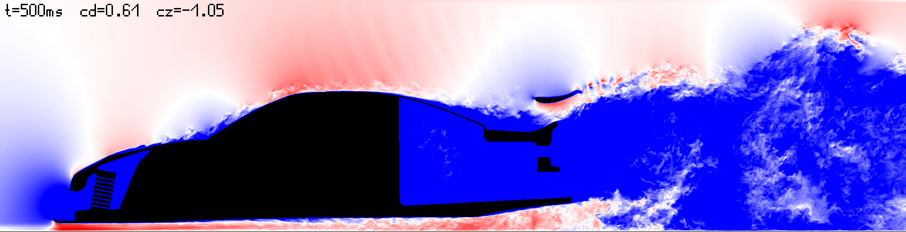
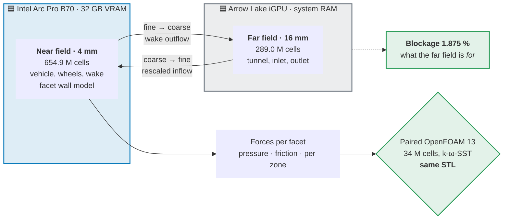

<div align="center">

# MaxAttack CFD Bench

### Vehicle aerodynamics at 4 mm on a single Intel GPU

**A lattice-Boltzmann wall-modelled LES that resolves the forces on a road vehicle<br>
on one workstation — and can prove every number it reports.**

<br>


</div>

> [!IMPORTANT]
> **Modified fork of [FluidX3D](https://github.com/ProjectPhysX/FluidX3D) by Dr. Moritz Lehmann.**
> This is **not** the original software and is not endorsed by its author. Licensed under the
> **unaltered** FluidX3D license — non-commercial use only, no military use.
> See **[NOTICE.md](NOTICE.md)** and **[MODIFICATIONS.md](MODIFICATIONS.md)**.

Built on [FluidX3D](https://github.com/ProjectPhysX/FluidX3D) by Dr. Moritz Lehmann. Upstream is
the fastest LBM solver of its class, running at 96–100 % of peak memory bandwidth. This fork does
not try to improve on that — and, at 94 % of peak measured on the Arc Pro B70, it does not give it
away either. It adds what a vehicle aerodynamics case needs and upstream does not
have: a wall model, sub-cell boundary geometry, a two-device domain decomposition, and an
instrumentation layer that makes silent errors loud.

---

## 📊 At a glance

| | |
|---|---|
| **Case** | Road vehicle, 4 mm near field, Re ≈ 8 × 10⁶, moving ground, rotating wheel contact |
| **Grid** | **654.9 M** fine cells on an Intel Arc Pro B70 (32 GB) + coarse far field @ 16 mm on an Arrow-Lake iGPU |
| **Drag** | **Cd 0.6085 ± 0.0137** vs OpenFOAM 13 **0.599** — within **1.6 %** |
| **Downforce** | **Cz −1.0535 ± 0.0234** vs OF13 **−1.301** — **81 %** of the reference |
| **Hardware** | One workstation. No cluster, no CUDA, no NVIDIA |
| **Memory** | **47 B per cell** on device, against 93 B for upstream FP32 |
| **Bandwidth** | **572 GB/s sustained — 94 % of the B70's 608 GB/s peak.** The solver is memory-bound by design; the card's 22.9 TFLOPs go unused |
| **Proof** | Every mechanism carries an action-path counter with an is = should acceptance. A switch without a firing counter is treated as a hard error |

<sub>Forces from the anchor run `p4_bandpi2_4` (git tag `anker-p4-bandpi2-4`), computed from the
field data in `cd_facetten.csv` over the window t ≥ 0.201 s, n = 300 samples, uncertainty = standard
error over six 50 ms block means. Composition is stated below — the two coefficients are not
interchangeable with the `cd_rest` figures in the run report, which are pressure-only.</sub>



*The production run this page reports. `p4_bandpi2_4`, Toyota MR2 at 30 m/s, near-field |u| on the
Y = 0.025 m slice at t = 500 ms — 15→45 m/s blue→white→red, black = solid. 654.9 M cells at 4 mm on
a single Arc Pro B70; engine bay with radiator fins resolved, rear wing attached, full turbulent
wake. This is an instantaneous LES field, not a mean.*

---

## 🎯 What this is, and what problem it solves

Vehicle aerodynamics at engineering accuracy normally means a RANS or hybrid solver on a cluster,
with a body-fitted mesh and a wall function that assumes the first cell sits in a log layer. That
route is well understood and expensive.

LBM is attractive for the opposite reason: it is a cartesian, memory-bandwidth-bound stencil that
maps almost perfectly onto a GPU. The price is that the wall is a **staircase of voxels**, not a
surface. At 4 mm on a car, a plain bounce-back wall behaves like a hydraulically rough one, the
stair-step normal is not the surface normal, and the boundary layer is unresolved by two orders of
magnitude.

Everything in this fork exists to pay that price honestly:

- **Recover the surface** from the voxel body — sub-cell wall distance per link, a fitted surface
  normal across the staircase, exact thin-feature voxelisation.
- **Model what the grid cannot resolve** — a facet-based wall model that drives the near-wall cell
  toward a law-of-the-wall target, plus a subgrid model that is consistent in the wall cell.
- **Fit a car on one GPU** — two-byte fields, a sparse-write pipeline, and a coarse far field on the
  integrated GPU while the discrete card carries the near field.
- **Never trust a number that has no counter.** This is not a slogan; see *How every number is
  proven* below. It has repeatedly caught mechanisms that were computing in the wrong place while
  every global figure looked right.

---

## 🧱 Why two domains: the blockage trap

A wall-modelled LES of a car needs two things that pull in opposite directions. The **near field**
must be fine enough to resolve the body — 4 mm. The **outer boundary** must be far enough away that
the tunnel walls do not squeeze the flow around the car and inflate the forces. That second
requirement is **blockage**: the model's frontal area against the tunnel cross-section.

Put numbers on it, and the trap is obvious:

| | Cross-section | Blockage vs A_ref = 1.850 m² | |
|---|---|---|---|
| Near box alone — 2.768 × 1.888 m | 5.23 m² | **35.4 %** | 🚫 unusable, the walls *are* the flow |
| With the far field — 10.160 × 9.712 m | 98.67 m² | **1.875 %** | ✅ below the 2 % convention |

> [!TIP]
> **1.875 % is measured on this grid, and it beats the paired reference:** the OpenFOAM 13 case
> `mr2v40H` this fork is validated against sits at **1.93 %**.

**So why not simply make the fine grid that big?** Because of what it costs. The far-field box is
**1 261 m³**. Filled uniformly at 4 mm that is **19.7 billion cells** — about **926 GB** at this
fork's measured 47 B per cell. No workstation has that.

The two-domain split buys the same blockage for **964 M cells instead of 19.7 G — a factor of 20** —
by spending resolution only where the forces are made, and merely *being present* everywhere else.

---

## 🔀 How the two devices split the problem



The discrete card's 32 GB buys resolution exactly where the forces are made. The domain that only
has to be *present* — the one that pushes blockage from 35 % down to 1.9 % — lives in system RAM,
where it costs nothing scarce.

---

## 📐 Results

Both coefficients are **totals**, because the OpenFOAM 13 reference is a total. The composition is
spelled out so that no figure here can be confused with another:

| Component | Value | What it is |
|---|---|---|
| `cd_druck_rest` | **+0.5614 ± 0.0132** | Pressure drag, wheel-contact band removed |
| `cd_reib` | +0.0470 ± 0.0006 | Friction drag |
| **Cd total** | **0.6085 ± 0.0137** | vs OF13 **0.599** |
| `cz_druck_rest` | **−1.1290 ± 0.0238** | Pressure downforce, band removed |
| `cz_reib` | +0.0755 ± 0.0004 | Friction — it works *against* downforce |
| **Cz total** | **−1.0535 ± 0.0234** | vs OF13 **−1.301** |

> [!NOTE]
> **Every mechanism in this fork carries an action-path counter with an is = should acceptance,
> and a switch without a firing counter is treated as a hard error.** The reason is concrete:
> in the predecessor fork, the central moving-floor fix was a silent no-op for years.
> See [How every number is proven](#how-every-number-is-proven).

**Why the band is split off.** The moving z-band around the wheel contact patch produces roughly
−0.7 of purely artificial downforce from the floor imprint. It is removed from the pressure term and
reported separately rather than quietly absorbed.

**The reference.** A paired OpenFOAM 13 run, 34 M cells, k-ω-SST, on the **same STL**. Validating
against an earlier version of one's own code is banned by project rule: it can only find porting
errors, and it confirms shared mistakes.


***The 4 mm field against the OpenFOAM 13 reference***, Y = 0.025 m slice: ΔU = |u|_OF13 − |u|_FX,
red = OF13 faster, blue = OF13 slower / FX over-accelerated, ±15 m/s, black = solid. The red rim
hugging the body is the boundary layer — the wall model brakes slightly harder than the RANS
reference. The mottled wake is the snapshot-versus-mean caveat and not a discrepancy: FX is an
instantaneous LES field, OF13 a RANS mean, so resolved eddies are being held against a smooth
average. **The mean-flow regions are the part that carries meaning.** Field statistics over
636 437 evaluable cells, frames aligned by x_v2 = x_OF13 + 2.2063: **RMS 4.26 m/s, median
−0.57 m/s, 1.66 % of cells clipping the ±15 m/s scale**.

<sub>**Which run this diff is from.** This is the 4 mm run `p4dt_deteps` (2026-09-11), not the
`p4_bandpi2_4` anchor whose forces head this page: no paired OF13 difference field has been produced
at 4 mm for the anchor yet, and rendering one from a different run and labelling it as the anchor's
would be exactly the kind of quiet substitution this project's rules exist to prevent. The two runs
differ in the Π-band wall treatment, whose effect was measured separately at 12/8 mm (RMS against
OF13 −9.9 %, share above 15 m/s −42.5 %).</sub>

**The open gap is downforce.** Drag is essentially closed; Cz sits at 81 % of the reference. That
deficit is the active work item, and it is stated here rather than hidden behind a favourable
selection of runs.

### The 4 mm production run, measured

Anchor run `p4_bandpi2_4` (git tag `anker-p4-bandpi2-4`), 501 ms physical, on one Arc Pro B70 plus
the Arrow-Lake iGPU:

| | |
|---|---|
| Fine cells @ 4 mm (B70) | **654.9 M** |
| Coarse cells @ 16 mm (iGPU) | **289.0 M** |
| Near-field VRAM | **28 698 MB** of 32 655 MB — **43.8 B per cell**, all buffers included |
| Far-field memory | **12 956 MB system RAM**, no VRAM ceiling |
| Wall clock | **75 min** |
| Performance index | **8398** s_wall / s_phys |

The far field living in system RAM is what makes the split worth having: the discrete card's 32 GB
buys resolution where it matters, and the domain that only has to be *present* costs nothing there.

### What more memory would buy

**First, the number that makes this table possible.** On the Arc Pro B70 this solver sustains
**4 648 MLUPs, which is 572 GB/s of memory traffic — 94 % of the card's 608 GB/s peak**. That is
measured here, on the sphere case at matched cell count, and it is the decisive property: an LBM
step reads and writes every cell's distributions once and does almost no arithmetic in between, so
**run time is set by memory bandwidth, not by FLOPs**. The B70 delivers 22.9 TFLOPs; this code
cannot use them, and does not need to.

That is also why the projection below is defensible at all. It scales two things — the work, which
is physics, and the bandwidth, which is a published hardware figure — and nothing else.

| Near-field memory | Fine cells | Resolution | Work vs 4 mm | Peak bandwidth | Run time |
|---|---|---|---|---|---|
| 32 GB — **Intel Arc Pro B70** | 0.65 G | **4.00 mm** | 1× | 608 GB/s | **75 min** — *measured* |
| 96 GB — **NVIDIA RTX PRO 6000 Blackwell** | 2.19 G | **2.67 mm** | ~5× | 1 792 GB/s | ~2.1 h |
| 320 GB — **4 × NVIDIA H100 80 GB SXM** | 7.30 G | **1.79 mm** | ~25× | 13 400 GB/s | ~1.4 h |
| 768 GB — **8 × RTX PRO 6000 Blackwell** | 17.5 G | **1.34 mm** | ~80× | 14 336 GB/s | ~4.2 h |

**How the table is built.** Cells go as dx⁻³ and, at fixed physical time, the step count goes as
dx⁻¹, so work goes as **dx⁻⁴** — that factor is physics and holds on any hardware. Memory per cell
is the one measured input: **43.8 B**, from the anchor run.

> [!NOTE]
> **All four figures are for 501 ms of physical time**, the length of the measured anchor run
> `p4_bandpi2_4`. The project's current standard run length is **739 ms** (5 × vehicle length), so
> multiply by **1.48** for a standard-length run — on the B70 that is 111 min rather than 75.

The three projected rows divide the measured 75 min by the ratio of **peak memory bandwidths**, on
one assumption: that a bandwidth-bound kernel reaches a **similar fraction of peak** elsewhere as
the 94 % measured here. For NVIDIA hardware that assumption is untested by this project — it is an
inference from the roofline, not a benchmark. Upstream FluidX3D reports 96–100 % of peak across
vendors, which is the reason to expect it to hold.

**Bandwidth figures are vendor specifications, not measurements taken here:** Arc Pro B70 608 GB/s
(256-bit, [Puget Systems review](https://www.pugetsystems.com/labs/articles/intel-arc-pro-b70-review/)
— the same source's 22.94 TFLOPS matches what our own device query reports, 22.938); RTX PRO 6000
Blackwell Workstation 1 792 GB/s (512-bit GDDR7, NVIDIA specification as tabulated by
[HOSTKEY](https://hostkey.com/blog/109-nvidia-rtx-6000-blackwell-server-edition-tests-benchmarks-comparison-with-workstation-and-rtx-5090-cooling-features/));
H100 80 GB SXM 3 350 GB/s (HBM3).

<details>
<summary><b>Two caveats that the last column does not contain</b> — click to read them, they matter</summary>

 The multi-GPU rows assume **perfect weak
scaling** — no interconnect cost, no halo exchange, no load imbalance. Real multi-GPU LBM does not
achieve that, so those two figures are optimistic by an amount this project cannot quantify. And
this fork's own decomposition is a *near/far* split across two devices of different speed, not an
N-way split of the fine domain; running the fine domain across four cards would use the upstream
path, **which this fork has not exercised**.

</details>

**What the table says without any assumption at all** is the useful part: the memory wall, not the
algorithm, sets the resolution today. The code already fits a full vehicle at 4 mm into 32 GB, and
the cost of the next halving in dx is a factor of sixteen in work — on any hardware, because that
factor is physics, not silicon.

### Independent validation rigs

| Rig | What it settles | Result |
|---|---|---|
| **Sphere resolution ladder**, D/dx 11 → 37.5 | Does the wall model beat plain bounce-back on a body whose drag is known from experiment? | Converges monotonically from below to **Cd 0.436** against the 0.45–0.5 subcritical band (Achenbach); the bounce-back baseline sits at **0.717**, 50–60 % over |
| **Plane channel**, N = 20, Lee & Moser | The wall model against a case with a literature answer | c_f coverage **48 % → 80 %** of the reference after taking the model input from the second fluid cell |
| **Tilted channel torus**, 0° / 26.565° / 45° | Isolates the staircase: the same physical wall presented as flat, as a 2:1 stair, as a 45° stair | Showed that a *global* sampling factor cannot fit a staircase — the per-class scatter is the diagnosis |

---

## 🧬 What this fork adds to upstream FluidX3D

Upstream is a general-purpose LBM solver. None of the following exists there; all of it was added
for this case. Every figure was measured on this rig.

### Wall treatment — the core of the fork

| Addition | Why it is needed | Measured effect |
|---|---|---|
| **Facet wall model (iMEM)** — TLS surface fit across the voxel staircase, Spalding target, 3×3 momentum solve for a slip velocity, with a saturation gate | Bounce-back on a 4 mm grid is a rough wall, and the stair normal is not the surface normal | Vehicle Cd 0.818 → **0.728** at 8 mm; action path proven at 1.3 G events, is = should exact |
| **ELIBB** — link-wise sub-cell boundary from a Surface-Nets remesh; the q > ½ branch is an MLS blend whose stability limit was derived, then measured | Places the wall where it is, instead of on the nearest cell face | **10.9 M cut links on 2.62 M facets** at 4 mm, **zero fallbacks**, stable to ω → 2 |
| **Model input from the second fluid cell** | The first cell is bounce-back-deflated *and* sits in the stair shadow; the fitted factor it replaced was calibrated on one geometry at one resolution | Channel u_τ factor **0.696 → 0.920**, c_f **+66 % at 38 σ** |
| **Mass-conserving momentum exchange** (α = 2 + gate) | The facet model injects momentum; uncorrected it also injects mass, and the leak *grows* with resolution | Sphere Δm 458.7 → **−1 × 10⁻⁶**; the uncorrected leak scales 272 → 13 149 from D/dx 11 to 37.5 |
| **Π-consistent multi-layer subgrid band** | The wall-cell subgrid model needs a consistent estimator outward from the first layer | Friction **−16.9 %** at 4 mm, shape factor H 1.613 |
| **Conserving clamps** (positivity, velocity) | Density and velocity clamps shift forces *systematically*, not as realisation scatter — proven with a 50-sample sign test | Standard since 2026-09-16, with the shift quantified rather than assumed |

### Geometry

| Addition | Why | Effect |
|---|---|---|
| **SAT voxelizer** — ray-parity bulk plus every cell any triangle intersects (exact triangle–box overlap), then interior void sealing | Ray parity drops any feature whose entry and exit land in the same cell — wing end-plates, splitter, louvres simply vanish | At 4 mm resolves wheel spokes, brake ducts, diffuser strakes, underfloor channels, wing + Gurney, splitter, canards, louvres, mirror |
| **The voxel body is the only wall truth** | Voxelisation thickens; an STL-derived normal and a voxel-derived normal disagree, and the wall model then silently mixes two geometries | Project rule: wall distance, normal and link occupancy all come from the same body |

### Fitting a car on one workstation

| Addition | Effect |
|---|---|
| **Two-device domain decomposition** — fine near field on the B70, coarse far field on the iGPU, with a smoothed coupling | The far field costs system RAM instead of VRAM |
| **Two-byte fields** for density and velocity | **47 B per cell** against 93 B for upstream FP32 |
| **Sparse field writes**, register-level scheduling, anisotropic block tiling | Wall clock for the 4 mm production run roughly halved over the project |
| **Real VRAM accounting from `/proc/*/fdinfo`** | `intel_gpu_top` cannot see the B70 — the `xe` driver has no i915 PMU. Root-free per-device utilisation instead of a reconstruction |

### Intel platform robustness

Upstream assumes a well-behaved driver. On `xe` and Arrow-Lake it is not always one: a teardown
segfault after the last export, a GEM-BO leak of 12–16 GB per killed run on the iGPU, zero-copy
buffers that spin above ~1 GB, and a discrete card whose host mirrors are freed where the integrated
one keeps them. Each of these is worked around, documented with its detection method, and written so
it can be retested on a future driver.

---

## 🔬 How every number is proven

This is the part that generalises beyond this car.

**Every mechanism carries an action-path counter** with a declared target. A switch whose counter
does not fire is a hard error, not a curiosity — in the predecessor fork a central fix had been a
silent no-op for years. Counters are checked as `is = should` against a number derived
independently, not against themselves.

**Diagnostics live in the code**, not in a notebook. Each new mechanism gets intermediate-result
introspection so that a small test case shows whether the *steps* are plausible, not only the
final force.

**Three independent audit passes** run after every build section — one over each function, one over
host and pipeline interplay, one over the interaction with other mechanisms and dead code. Findings
are fixed and re-checked until clean. A representative catch: a subgrid band whose action-path
counter matched its target to the last digit was dereferencing bounding-box indices as global grid
indices — correct on the channel, where the two spaces coincide, wrong on the vehicle. The counter
was right and the mechanism was computing in the wrong place.

**One variable per run**, criteria written down *before* the run. Mixed arms invalidate results
retroactively, and you find out only when you go looking for a cause.

**Rejections are kept visible.** A mechanism that was built, measured and found not to work is a
result. Keeping it on record is what stops it being proposed again.

**Every run carries its own source.** A full code copy and commit hash land in
`export/<run>/code/`, so "which code produced this number" is answerable six weeks later without
archaeology. GPU runs go through a locked queue with a status file and a process census.

---

## ⚙️ Build and run

```bash
g++ src/*.cpp -o bin/FluidX3D -std=c++17 -pthread -O -Wno-comment \
    -I./src/OpenCL/include -L./src/OpenCL/lib -lOpenCL
```

Cases and mechanisms are selected by `CFD_*` environment variables; the production configuration is
generated from a machine-written baseline file (`basis/*.basis`) rather than assembled by hand —
reconstructing one by hand once cost a full morning of measurements.

---

## 🚦 Status

<div align="center">

| | | |
|---|---|---|
| ✅ | **Drag** | closed against the reference — within **1.6 %** |
| 🚧 | **Downforce** | **81 %** of the reference — *the open problem* |
| ✅ | **Wall-cell reconstruction** | built, force-booked, booking defect corrected and accepted |
| 🚧 | **…at 4 mm** | **never run there** — effect on Cz is unmeasured |
| 🚧 | **…amplitude derived** | still a hand-set knob — next build step |

</div>

The current line of work is a **wall-cell reconstruction**: it imposes the wall-model target on the
cells where the tangential solve is rank-deficient — roughly a fifth of all wall facets, because a
cell with a single wall link cannot span two tangential directions. It is built, force-booked, and
the momentum balance behind the booking is measured rather than assumed.

**What is accepted.** The mechanism is bit-neutral where it must be: with zero amplitude the field
hash is identical to the reference, measured, not argued. A defect found in the force booking — the
wall-link part of the injected momentum entered the wall force twice — is corrected exactly rather
than to leading order, which the measurement justified: at 93 % of marked cells the second
tangential channel carries more than a tenth of the first, and a leading-order fix would have
dropped it. The correction is confined to the friction path; every pressure-path quantity is
bit-identical across it, in both signs of the amplitude.

**What is not.** Two things, stated plainly because they are what a reader would otherwise assume:

1. **The reconstruction has never run at 4 mm.** Every arm so far is a channel, a sphere, or the
   vehicle at 8 mm — and 8 mm cannot resolve Cz. What it does to downforce at production resolution
   is *unmeasured*. The 81 % above is the production baseline **without** it.
2. **Its amplitude is still a hand-set knob.** The project rule is that constants are derived, not
   dialled, and until the wall-model target sets the injected momentum itself, this is a probe
   rather than a model. That derivation is the next build step, and it is larger than anything
   behind it.

The measurements behind every claim above — including the arms that were rejected — live in the
project's working notes and the run archive, which are kept out of this repository on purpose: they
are a laboratory notebook, not documentation. The commit history carries the same record in the
form that belongs here.

---

## 🗺️ LBM solver landscape — why FluidX3D on this hardware

An LBM step reads and writes every cell's distributions and does almost no arithmetic in between.
**Two numbers therefore decide everything: how many bytes a cell costs per step, and what fraction
of peak bandwidth the code actually reaches.** Everything else is features.

### What a cell costs, and why it is the whole game

**Two different numbers, and they are often confused.** *Storage* is what a cell occupies in VRAM;
*traffic* is what must cross the memory bus every time step. The resolution you can fit is set by
storage; the run time is set by traffic.

| Storage per cell, on device | | |
|---|---|---|
| Upstream, FP32 throughout | 93 B | |
| Upstream, FP16S for the distributions | 55 B | |
| **This fork** | **47 B** | 38 (19 × FP16S) + 6 (u) + 2 (ρ) + 1 (flags) |

> [!NOTE]
> **Three numbers appear for this in the project, and all three are right — they measure different
> things.** **47 B** is the per-cell arithmetic above. **45.7 B** is a measured allocation
> (23 734 MB for 519 139 485 cells). **43.8 B** is the 4 mm anchor run (28 698 MB for 654.9 M
> cells) — *lower*, because buffers that do not scale with cell count amortise better on a larger
> grid. The force field `F` is the main one: it lives only over the wall bounding box, not over the
> domain, which is what buys 4.31 GB at 4 mm.

| Traffic per cell per step | | |
|---|---|---|
| Textbook D3Q19, two lattices, FP32 | 152 B | 19 × 4 B, read + write |
| FluidX3D, FP32/FP32 | 153 B | upstream, [`README_UPSTREAM.md`](README_UPSTREAM.md) |
| FluidX3D, FP32/FP16 — distributions + flags only | 77 B | upstream, same source |
| **This fork, vehicle case** | **115 B** | `bandwidth_bytes_per_cell_device()`, `src/lbm.cpp` |

The 38 B above upstream's 77 B are not overhead — they are the vehicle case: **u (6) + ρ (2) for the
field output, the force field (12), and the neighbour flags (18) that a moving-boundary case must
load.** Upstream's 77 B counts distributions and flags alone.

> [!TIP]
> **Arithmetic intensity 2.37 / 5.27 / 16.56 FLOPs per byte** (FP32/FP32, FP16S, FP16C — upstream's
> figures). At those ratios no GPU on the market is compute-limited for LBM. **A solver's FLOPs are
> irrelevant; only its bytes and its bandwidth efficiency matter.**

### Reaching peak bandwidth — the one number we measured ourselves

| | |
|---|---|
| Arc Pro B70, peak | 608 GB/s ([Puget Systems](https://www.pugetsystems.com/labs/articles/intel-arc-pro-b70-review/)) |
| **This fork, sustained** | **572 GB/s = 94 % of peak** — measured, sphere case at matched cell count |
| Upstream's claim across vendors | 96–100 % of peak |

> [!IMPORTANT]
> **We have no comparable figure for any other solver.** Published MLUPs numbers are not comparable
> without the bytes-per-cell of the same build, and we have not benchmarked the others on this
> hardware. Stating a percentage for them would be a guess, so this table does not.

### Which solvers run on this hardware at all

| Solver | GPU backend | Runs on Intel Arc? | Built-in wall model |
|---|---|---|---|
| **FluidX3D** | OpenCL | ✅ **native** | ❌ — *this fork adds it* |
| Palabos | C++ stdpar since the 2025 GPU port ([arXiv:2506.09242](http://arxiv.org/abs/2506.09242)) | ⚠️ hardware-agnostic in principle, untested here | ✅ Werner–Wengle |
| OpenLB | SYCL / CUDA | ⚠️ experimental on Intel | ✅ Musker + van Driest |
| waLBerla | CUDA / HIP | ❌ | ✅ generic (power-law, Spalding) |
| TCLB · lbmpy · Musubi | CUDA / HIP | ❌ | partly |
| Sailfish | OpenCL | ⚠️ abandoned upstream | ✅ Bouzidi + power-law |

### What none of them solves

Several carry a wall function. **None carries a wall model that works on a staircase-voxelised
curved body at automotive Reynolds numbers** — the case where the surface normal is not the cell
normal and a fifth of all wall cells cannot span two tangential directions. That gap is the reason
this fork exists, and it is the part that is genuinely hard.

The honest summary: **FluidX3D was chosen because it is the only production-grade LBM solver that
runs natively on this hardware and moves the fewest bytes per cell.** What it lacked for a vehicle
— the wall model, sub-cell boundary geometry, the two-device split — is what the fork adds.

## 🔗 Companion repositories

Same hardware, same fight — getting a professional CFD stack to run on Intel instead of NVIDIA.

<div align="center">

[](https://github.com/heikogleu-dev/Paraview---Intel-B70-Pro-OSPRAY-Raytracing-Pathtracing)

[](https://github.com/heikogleu-dev/Openfoam-v2512-Petsc-Kokkos-Sycl-Intel-B70)

[](https://github.com/heikogleu-dev/Openfoam13---GPU-Offloading-Intel-B70-Pro)

</div>

---

## 📚 Original FluidX3D documentation

The upstream README is preserved verbatim as **[README_UPSTREAM.md](README_UPSTREAM.md)** — including
upstream's benchmark tables and, importantly, its **reference list**. Publications that use this
software must cite those references. Upstream's user documentation is likewise preserved as
[DOCUMENTATION.md](DOCUMENTATION.md).

Nothing on this page replaces those. Where this README and the upstream one disagree about what the
software does, the difference is a modification made here, and
[MODIFICATIONS.md](MODIFICATIONS.md) is the place it is accounted for.

---

## ⚖️ License & Attribution

> [!WARNING]
> **This is not FluidX3D.** It is a modified version of it, and it is **not endorsed** by FluidX3D's
> author. *"FluidX3D"* is a protected work title of Dr. Moritz Lehmann.

- Original software: **FluidX3D**, © 2022–2026 **Dr. Moritz Lehmann** —
  <https://github.com/ProjectPhysX/FluidX3D>
- License: **[LICENSE.md](LICENSE.md)**, byte-identical to upstream and not to be altered.
  Non-commercial use only. No military or defence use. No AI training on the source. Altered
  versions must be marked as such and their source published. The FluidX3D references must be cited
  in scientific publications.
- Attribution notice: **[NOTICE.md](NOTICE.md)**
- What was changed, and what deliberately was not: **[MODIFICATIONS.md](MODIFICATIONS.md)**

This fork is marked as altered, its origin is not misrepresented, the license notice is preserved,
and its source is public. Internal code identifiers still carry the upstream names so that upstream
changes remain mergeable — that is a compatibility decision, not a claim of identity.
