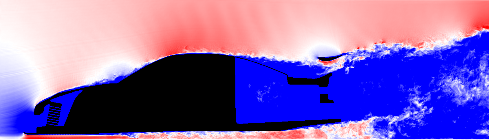
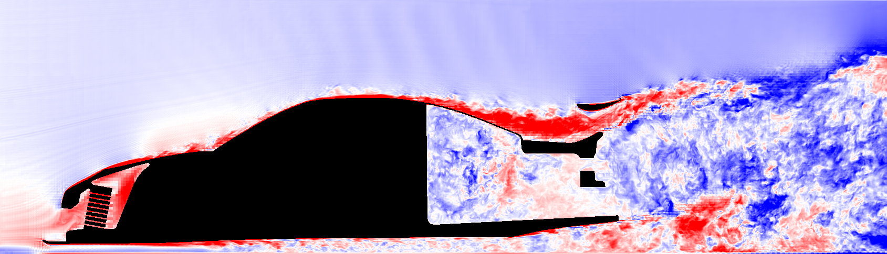
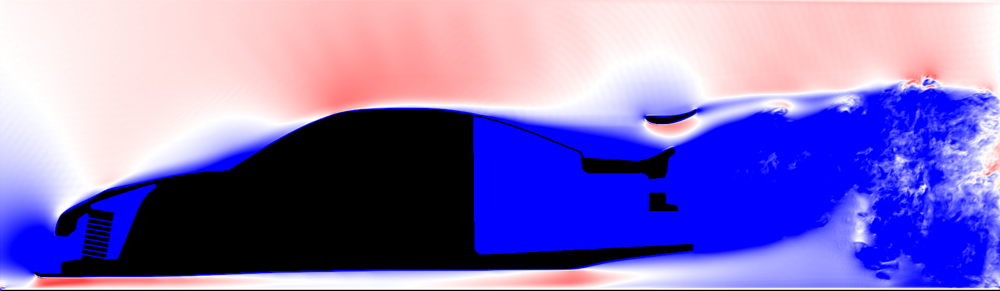
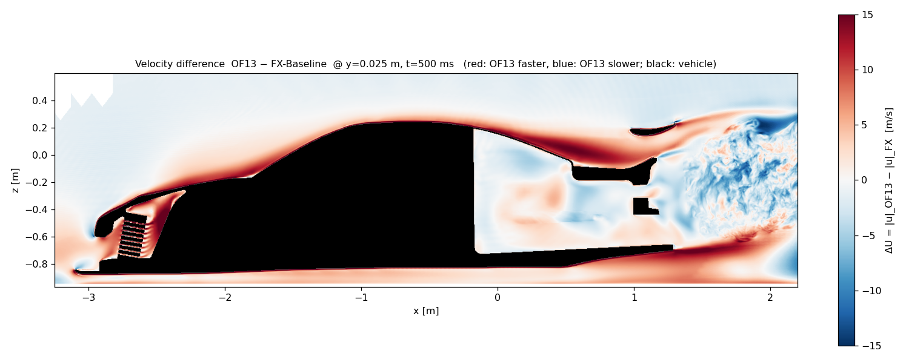
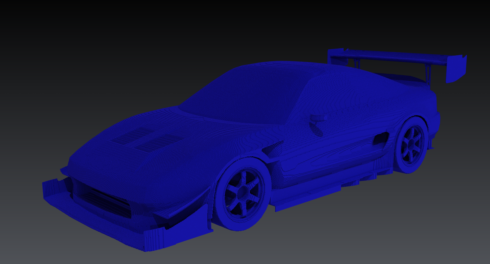
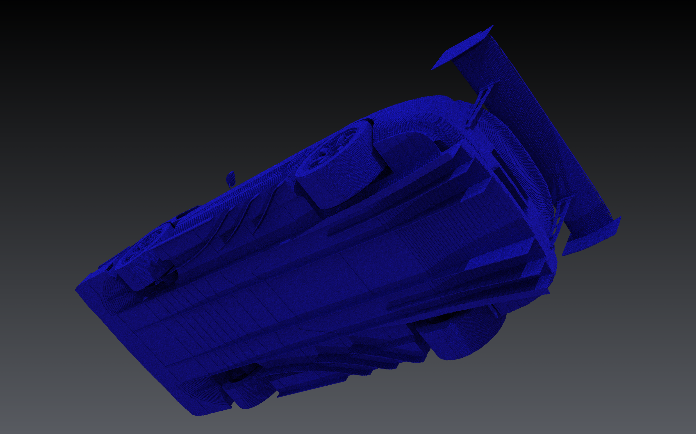

# FluidX3D — Intel Arc Pro B70: Vehicle Aerodynamics (LBM-WMLES vs. OpenFOAM)

**Performance & results at a glance** *(all numbers measured on this rig; production run
`f4_vollumfang_mls`, 2026-08-27, commit 94a802c — 508.7 M fine cells @ 4 mm on the B70 +
203 M coarse cells @ 16 mm on the iGPU, 50 000 fine steps = 0.5 s physical, wall clock 91 min)*

| Metric | Value | Context |
|---|---|---|
| **Cd (artefact-corrected, window mean)** | **0.805 ± 0.010** | OpenFOAM 13 reference: 0.599 |
| **Cz (artefact-corrected, window mean)** | **−1.180 ± 0.016** | OF13: −1.301 → **91 % of the reference downforce** |
| **Performance index** | **10 958 s_wall/s_phys** | the full wall-model chain costs **zero** (91.3 min vs. 92 min without it) |
| **B70 kernel (8 mm screening rung)** | **1 534 MLUPs / 189 GB/s** | **+63 %** vs. the pre-optimisation era (939 MLUPs) |
| **Dual-GPU overlap** | **CONCURRENT 96.1 %** | B70 93.9 % busy @ 2.5 GHz mean, iGPU 91.0 % (fdinfo profiler, 180 s) |
| **VRAM (4 mm production)** | 29 318 / 32 655 MB | predicted by the pre-flight audit to within 3 MB |
| Single-domain B70 baseline | ≈ 5 464 MLUPS | 96–100 % of peak bandwidth (upstream solver quality) |


*First full-configuration 4 mm production run (`f4_vollumfang_mls`): Toyota MR2 at 30 m/s
(Re ≈ 9 M), near-field |u| at t = 500 ms (15→45 m/s blue→white→red, black = solid). Engine bay
with radiator fins resolved, rear wing attached, full turbulent wake — and the corrected force
window of this run is the table above: **the first time this fork produces real downforce.***


***Today's run against the OpenFOAM 13 reference** on the Y = 0.025 m slice — same convention as
the V1 header image below: ΔU = |u|_OF13 − |u|_FX, red = OF13 faster, blue = OF13 slower / FX
over-accelerated, ±15 m/s, black = solid. The over-roof over-acceleration that defined V1 is
reduced to a pale shadow; the red rim hugging the body is the boundary layer (the wall model
brakes slightly harder than the RANS reference), and the mottled wake is the snapshot-vs-mean
caveat (FX is an instantaneous LES field, OF13 a RANS mean — resolved eddies against a smooth
average; the mean-flow regions are the meaningful comparison). Field statistics of this diff
(670 217 cells, alignment per the established frame mapping x_v2 = x_OF13 + 2.2063):
**RMS 5.1 m/s, median −2.2 m/s, only 1.8 % of cells clip the ±15 scale.***

A fork of [ProjectPhysX/FluidX3D](https://github.com/ProjectPhysX/FluidX3D) tuned for **vehicle
aerodynamics on a single Intel Arc Pro B70 (Battlemage) + Arrow-Lake iGPU**. The base solver runs
at **96–100 % of peak memory bandwidth (≈ 5 464 MLUPS)** on the B70 via OpenCL. On top of that this
fork adds a force-resolving, multi-resolution dual-GPU stack for a Toyota MR2 race car, validated
against an OpenFOAM 13 k-ω-SST reference (34 M cells: **Cd 0.599 / Cz −1.301**) on the **same STL**.

This is the **second generation (V2)** of the fork. The first generation — the B70-Pioneer work
from May to August 2026 — was retired on 2026-08-15 and rebuilt from scratch under hard working
rules; the reasons are in *Why V2 instead of the old fork* below. Everything under
*Carried over from V1* is taken from that first generation **unchanged**: those findings are still
valid and still the ground the current work stands on.

- Upstream docs: [README_UPSTREAM.md](README_UPSTREAM.md) · license **unchanged** (non-commercial /
  non-military): [LICENSE.md](LICENSE.md)
- **Branch policy:** single-branch, all work on `master`.
- **The README is the current state only; the full evidence chain lives in the project markdowns**
  (table below) — `AUDIT-BEFUNDE.md` is the leading record. Those documents are in German.

---

# V2 — the rebuild

## Why V2 instead of the old fork

The first fork (V1) had grown exploratively over months: mechanisms without proof of effect (the
central moving-floor fix turned out to be a **silent no-op for years**), mixed measurement arms, no
reproducible chain of evidence. V2 is the disciplined rebuild of the same task under hard working
rules ("Iron Rules"):

1. **Every mechanism proves its effect in the binary** — action-path counters, is=should acceptance
   tests, self-checks. A switch without a firing counter is a hard error, not a detail.
2. **Agent pipeline** — a planning review before and an adversarial audit review after every
   implementation; audit-correction loops until "no findings".
3. **One variable per run** — screening on the fast 8 mm rung (~10 min/run), production (4 mm) only
   for validated winners.
4. **One runner, one chain, one watchdog** — GPU series start only through a locked queue with a
   status file.
5. **Measure on data, never on pictures** — field CSVs and probes, never rendered images. A picture
   shows what the renderer made of it, not what was computed.

## What this fork changes vs. upstream FluidX3D — at a glance (updated 2026-09-03)

Upstream is a general-purpose LBM solver that already runs at 96–100 % of peak memory bandwidth.
Everything below was added or replaced for one purpose: **resolving forces on a road vehicle at a
resolution that fits on one workstation GPU, and being able to prove every number.** Figures are
measured on this machine unless marked otherwise.

| Area | What changed vs. upstream | Why | Measured effect |
|---|---|---|---|
| **Wall model** | Cell-based facet chain: TLS surface fit across the voxel staircase → Spalding target → 3×3 momentum solve for a slip velocity (iMEM), with a saturation gate and mass correction | Plain bounce-back on a 4 mm voxel grid is a hydraulically rough wall; the stair-step normal is not the true surface normal | Vehicle Cd 0.818 (BB) → 0.728 (8 mm, arm `s5b`); action path proven at 1.3 G events, is=should exact |
| | **ELIBB** link-wise geometric boundary on top: Surface-Nets remesh supplies per-link wall distance q; q > ½ branch is the MLS χ-blend, χ = (2q−1)/(τ₀+½) | Sub-cell wall placement instead of stair-step; the predecessor branch was spectrally unstable (λ_krit = 4(2−ω)/(ω−1), derived and measured) | 10.9 M cut links on 2.62 M facets at 4 mm, zero fallbacks; stable to ω → 2, q = 1 |
| | **Wall-model input from the second fluid cell** (`CFD_FAC_NACHBAR`), replacing an empirically fitted 3/2 factor | The first cell is bounce-back-deflated (P₁ ≈ −u/3) *and* sits in the stair shadow; the fitted factor was calibrated on one geometry at one resolution | Channel u_τ factor **0.696 → 0.920** (c_f +66 %, 38 σ). Per-class scatter of tw/target across stair classes **1.26 → 1.02** — a global factor made it *worse* (1.34) |
| | Wall-model coverage fix (y_w clamp instead of discard, coherence edge test) | 19.9 % of wall cells had no wall model at all | **19.9 % → 4.5 %** cells without wall model (4 mm: 146 198 of 3 275 383) |
| **SGS / turbulence** | `CFD_SGS_FDWAND`: ν_t at wall cells from a finite-difference \|S\| of the velocity field instead of the Π-tensor | The wall model writes non-hydrodynamic populations into f; Smagorinsky built its tensor from them — ghost-mode inflation of **2.33×** in the dominant wall class (measured) | Channel kipp26 u_τ factor 0.778 → **1.107**; 8 mm shape factor H 2.00 → **1.77** (OF13 target 1.18), u_t at the first cell +25…36 % |
| | WALE and Sigma evaluated and **rejected**, van Driest rejected | Measured, not assumed: the wall cells are near-pure shear (\|Ω\|/\|S\| ≈ 0.99) | WALE/FD 1–4 % of Smagorinsky — no lever. van Driest: c_f collapse ×15.9 at the D = 0 limit |
| | Double-booking of SGS and wall model **disproved**, and a permanent detector added | It was the planned next build step; the premise turned out to be wrong | ⟨τ_w,model⟩ / (f·δ) = **0.995** on the flat channel (an additive double-booking would need ≈ 0.5). Cross-checked against OpenFOAM 13's `nutUWallFunction`, which is built the same way |
| **Resolution / domains** | Dual-domain: fine 1689 × 661 × 465 @ 4 mm (519 M cells) on the B70, coarse 768 × 480 × 552 @ 16 mm (203 M) on the iGPU, one-way coarse → fine with cubic boundary lift | A single 4 mm box large enough for a correct wind-tunnel blockage does not fit in 32 GB; a small box distorts the pressure field | Coupling costs **0.8 % of step time**; far-field blockage **2.74 %** (OF13 reference 1.93 %) while the near field stays at 4 mm |
| **Boundary physics** | Moving-floor equilibrium reset, inlet reset + damping zone, tyre-contact force split | The far-field floor ran in a staggered mode (period-2 at τ ≈ 0.5) that killed under-body flow; the floor imprint produced artificial downforce | Freestream streaks −99 %; the tyre imprint was worth ≈ **−0.7 Cz of artificial downforce** — quantified and removed |
| **Number format** | FP16S (range-shifted) instead of FP16C, measured against an FP32 arm | Both are 2 B/DDF; the question was which one the wall model tolerates | **1373 (FP32) → 1924 (FP16C) → 2246 MLUPS**. FP16S is not only faster but *closer to FP32*: c_z error under FP16C −0.0119 at 2.17 σ, under FP16S +0.0038 at 0.70 σ |
| **Performance** | GPU-side force reduction instead of PCIe transfers; IGC unroll-budget fix; store_f rematerialisation; F-buffer null-read gate; offline ocloc scratch/spill gate in CI | A grown kernel loop had silently gone memory-resident — every DDF access ran through scratch | Force window **36 % → 1.3 %** of step time; the unroll fix was a measured **100×** on the affected arm (private_size 4256 B → 0); +3.7 % kernel from the null-read gate |
| **VRAM** | Force field allocated over a bounding box instead of the full grid; smoothing index over the facet BBox; two-stage memory plan with a hard pre-flight check | The constructor pre-check computed `FORCE_FIELD` over the full grid and rejected grids that actually fit | **4.31 GB** saved on F alone; smoothing index 593 MB instead of 1980 MB; the memory plan predicted the run to the megabyte (29 672 MB, 487 MB slack) |
| **Instrumentation** | 80 action-path counters with is=should assertions, force-path K2/K3 validation, bit-anchor field hash, block-SEM statistics, per-stair-class wall diagnostics, paired 100 ms force comparison | Project rule: a switch without a firing counter is a hard error — in the predecessor fork a central fix had been a silent no-op for a year | Six instruments were found **measuring wrong** and fixed (e.g. a y⁺ histogram off by a factor of 18); several switches were found to be silent no-ops before they were ever used for a result |
| **Validation** | Paired A/B methodology against OpenFOAM 13 (34 M cells, k-ω-SST, **same STL**), one variable per run, criteria written before the run | Comparing against an earlier version of one's own code proves nothing about physics | Reference Cd 0.599 / Cz −1.301. Current 4 mm: cd_druck_rest 0.537, cz_druck_rest −0.951 — the drag side is close, **the downforce gap of ≈ 27 % is the open problem** |

**Known open points** (kept here on purpose): the downforce deficit above; one wall-model
report line contradicts the force CSV by a factor of two and is under investigation; the wake
length of the near-field box is assumed, not measured; and the boundary-layer thickness at 8 mm
remains resolution-bound — no wall-model switch fixes that.

## What is implemented (2026-08-27)

- **Dual-domain coupling fine↔coarse** (B70 + iGPU, real parallel scheduling, coupling share ~1 %),
  cubic boundary lift, bit-exact coverage-point verification chain, interface instrumentation.
- **Cell-based facet wall model (iMEM)** — TLS surface fit across the voxel staircase, Spalding
  target, 3×3 momentum coupling, saturation gate, mass correction. Fully action-path proven
  (1.3 billion events is=should exact, Δm within band).
- **ELIBB link-wise geometric boundary (q-blende)** on top of iMEM: a Surface-Nets remesh of the
  voxel staircase supplies per-link wall distances q (10.9 M cut links on 2.62 M facets at 4 mm,
  zero fallbacks); sub-cell wall placement replaces stair-step bounce-back. The q > ½ branch is the
  **MLS chi-blend** — χ = (2q−1)/(τ₀+½), u_bf = (1−3/(2q))·u — verified term-by-term against the
  NASA/ICASE prints (the form is from *J. Comput. Phys. 161 (2000) 680* / *Phys. Rev. E 65, 041203
  (2002)*, **not** the 1999 paper everyone cites), spectrally stable to ω → 2, q = 1; the
  predecessor branch's wall-ghost-mode instability was derived analytically
  (λ_krit = 4(2−ω)/(ω−1)) and recorded in the internal working notes. Both branches carry
  their own action-path counters (this run: 894 M / 1.68 G firings, is=should exact).
- **Floor / inlet physics** — moving-floor equilibrium reset (cures the measured staggered mode of
  the far-field floor), inlet reset + damping zone (freestream streaks −99 %), tyre-guard force
  measure (the floor imprint produced ~−0.7 of **artificial** downforce — quantified and eliminated).
- **Measurement instruments in the code** — force decomposition wheel-contact/body with a moving
  z-band artefact split (the corrected `cd/cz_druck_rest` in the headline table), underbody /
  floor / inlet column probes, interface pressure, displacement census, block-SEM statistics,
  near-vs-far difference slice (`CFD_DIFF_SCHNITT`) and a world-positioned VTK field export of both
  domains (`CFD_VTK_ENDE` + timed dumps `CFD_VTK_DT`); post-hoc y-slice rendering from the VTK
  dumps (`werkzeuge/vtk_yslice.py`, pixel-identical to the in-run renderer).
- **Performance** — GPU-side force reduction instead of 2.5 GB PCIe transfers (force window
  36 % → 1.3 %); IGC unroll-budget fix (a grown kernel loop had silently gone memory-resident:
  private_size 4 256 B → 0, a measured **100×** on the affected arm), store_f rematerialisation
  and an F-buffer null-read gate (+3.7 % kernel); an offline ocloc **scratch/spill gate**
  (`werkzeuge/scratch_gate/`) fails any commit that regresses private/spill memory to zero-cost.

## The facet wall-model chain — methodology

Upstream FluidX3D has no wall model; the entire WMLES layer is this fork's own build. The chain,
stage by stage, each with its in-binary proof mechanism:

1. **Geometry → facets.** The SAT voxelizer (below) gives a conservative solid. A **Surface-Nets
   remesh** of the voxel staircase (one vertex per boundary cell, Taubin-smoothed, vertices
   clamped to ±½ cell) recovers the smooth wall; exact ray–triangle intersection then yields a
   **per-link wall distance q** for every lattice link that crosses the surface. At 4 mm:
   10.87 M cut links on 2.62 M facets, 100 % from the remesh, zero fallbacks.
2. **Facet fit.** Per wall cell a TLS/PCA plane fit across the staircase provides the facet
   normal and wall distance; a guarded q-floor and a grazing-link guard (κ = 0.4) keep
   ill-conditioned links on plain bounce-back (both declared interims with replacement duty).
3. **iMEM momentum exchange** (after Asmuth et al. 2021, Eq. 20–28): Spalding-target wall
   stress, a 2×2 tangential solve per facet, saturation gate with BB fallback, α mass
   correction. Proof: 1.3 G events is=should exact each run, Δm within its band.
4. **ELIBB link-wise reconstruction** replaces stair-step bounce-back using the per-link q:
   below q = ½ a Bouzidi/NEBB blend; **exactly q = ½ collapses bit-identically to plain iMEM**
   (the standing bit anchor of the whole chain); above q = ½ the **MLS chi-blend**
   χ = (2q−1)/(τ₀+½), u_bf = (1−3/(2q))·u — the predecessor scheme's wall-ghost-mode
   instability was first derived analytically (neutral curve λ_krit = 4(2−ω)/(ω−1): at
   production ω practically every q > ½ was unstable, masked only by SGS viscosity), then the
   replacement was verified term-by-term against the NASA/ICASE prints before a single kernel
   line changed. Both branches carry separate action-path counters.
5. **Momentum booking (B3).** Whatever the blend changes in the incoming populations is booked
   into the friction-path accumulator — friction path and object force stay one picture.
6. **Acceptance ladder** for every wall-model change: CPU harness (bit anchors, stability
   sweeps) → channel bit anchor on the iGPU (field hash must not move — the change must be
   provably inert outside its branch) → sphere detector (the historic injection pathology:
   a sign flip here killed the predecessor scheme) → tilted-channel K2 friction-path detector
   → 8 mm vehicle A/B on identical env → only then 4 mm production. One variable per run.

## Performance engineering on Battlemage — what actually moved the needle

All deltas measured on this rig, same-env A/B unless noted; chain result on the 8 mm vehicle
rung: **939 → 1 534 MLUPs (+63 %)**, and the 4 mm production index went 12 429 → **10 958** with
strictly more physics on board.

| Lever | Measured effect |
|---|---|
| **IGC unroll budget** — a grown kernel loop silently exceeded IGC's unroll budget; runtime-indexed private arrays went memory-resident (`private_size` 4 256 B/WI) | **~100×** on the affected arm (2 → ~240 MLUPs class); fix is one `opencl_unroll_hint`, found **offline** via ocloc/zeinfo |
| **store_f rematerialisation** — a register spill from address CSE across the facet block | +3.0 % B70 kernel (1 478 → 1 523), spill 448/832 B → 0 |
| **F-buffer null-read gate** — skip reading a force field that is provably +0 at non-solid cells | +0.7 % (1 523 → 1 534), guarded by a host-side invariant scan at init |
| **GPU-side force reduction** (FAC_GPU) instead of 2.5 GB PCIe transfers per force window | force-window share 36 % → 1.3 %; at production cadence ~13 % wall clock |
| **Slice plane-gather** — read one y-plane instead of full fields at slice events | 11.3 GB → plane-sized PCIe per slice event |
| **Zero-copy blocking-read fix** (iGPU) — all 8 read/write wrappers finish the queue correctly | correctness + removes silent stalls on the far domain |
| **Scratch/spill gate** (`werkzeuge/scratch_gate/`) — offline ocloc compile of the real kernel for both GPUs on every change | regression protection: `private_size = 0 AND spill_size = 0` or the gate fails — the 100× class can never return silently |

The remaining big levers (FP16S memory compression, UPDATE_FIELDS retirement, dual-B70 halo
+ iGPU three-device layout) are deliberately parked behind physics work — documented with their
expected mechanics in the project markdowns.

## The validated production configuration

What `f4_vollumfang_mls` actually ran (every switch audited: 32/32 env vars traced to their
consumer **and** a runtime action-path proof — a switch without a firing counter is treated as a
hard error in this project):

- **Domains:** fine 1689×621×485 @ 4 mm (508.7 M cells, B70) inside coarse @ 16 mm (203 M cells,
  iGPU zero-copy), one-way far→near TYPE_E coupling plus **near→far feedback bands** (wall-free
  band variant: profile/plateau shaping, wake band, band starts ≥2 coarse cells off the body).
- **Boundary physics:** moving-floor equilibrium reset (near + far, its own reset counters),
  far-inlet equilibrium reset, sponge layer (far), pressure outlet.
- **Wall chain:** facet model level 3 + saturation gate + α=2 mass correction + ELIBB with the
  MLS q>½ branch (chain above), sampling-factor 1.5 (declared interim).
- **Instrumentation on board:** per-sample force CSVs with wheel-contact z-band split (the
  corrected `cd/cz_druck_rest` headline numbers), facet-path Cd decomposition at every sample,
  displacement census, block-SEM statistics, timed VTK field dumps + end dump, stop-file
  graceful shutdown, a GuC-engine-reset watchdog on the kernel journal, and a locked run queue
  with process census before and after every series.

Reproduce: the exact env line ships in `logs/f4_vollumfang_serie.txt` and — like every run — a
full copy of the sources plus commit hash lands in `export/<run>/code/` (`LAUF.txt`).

## Where we stand (2026-08-27, run `f4_vollumfang_mls`)

First 4 mm production run with the **full validated chain** (iMEM + ELIBB/MLS + near→far feedback
bands): artefact-corrected window means **Cd 0.805 ± 0.010 / Cz −1.180 ± 0.016** against
OF13 0.599 / −1.301. The chain's Cz contribution is unambiguous — the identical run without it
(previous day, `f4_wandfrei_v2`) measured a raw window Cz of −0.134 vs. −0.579 with the chain,
a 15-block-SEM separation; the corrected Cz reaches **91 % of the reference downforce**. And it is
free: 91.3 min wall clock vs. 92 min without the chain, VRAM +47 MB.

What remains, in order of size:
- **Cd is +34 % over the reference** (0.805 vs. 0.599), trending down within the run. The
  dominant known contributor is the friction path of coherent shallow-staircase surfaces
  (the "26° class"): its momentum bookkeeping misses its target by design of the staircase, a
  standing finding across the whole comparison chain, attributed — not caused by the wall formula
  (at 45° the path closes to within 13 %). The fix chain (booking closure → m6+m7 stair cluster →
  link-count-aware sampling factor) is derived and queued in the project's internal working records.
- **Declared interims** in the wall chain (each with its replacement condition documented in-code):
  τ₀ instead of local τ_eff in the MLS blend, tangential projection of the boundary velocity,
  grazing-link guard κ = 0.4, q-floor 0.1, sampling factor 1.5.
- **Near-field y-interfaces sit too close** for the wheel wake (decided 2026-08-26): widening is
  the first use case for the dual-B70 halo + iGPU plan — a single 32 GB card cannot hold the wider
  near box at 4 mm (35.3 GB needed).

The coupling itself is sound and measured (forward RMS |Δu| 1–3 % of freestream ahead of the nose;
deviation is generated at the body rim the 16 mm far field cannot resolve). Full evidence:
`AUDIT-BEFUNDE.md` (leading record; the wall-model chain incl. the K1'-instability derivation
and the MLS acceptance ladder S0–S4 is recorded there and in the internal working notes).

## The evidence chain

| File | Purpose |
|---|---|
| **AUDIT-BEFUNDE.md** | Chronological findings/acceptance record of all audits and runs — **leading** |
| **FACETTEN.md** | Entry point for the facet wall model: architecture, full switch reference, acceptances |
| **WANDMODELL.md** | Wall-model / channel state of knowledge: rough-wall finding chain, WFB result |
| **DOPPEL-DOMAENE.md** | Two-domain case: geometry, coupling, deliberate limits |
| **EINLASS-AUSLASS.md** | Boundary-condition analysis: ringing, damping zone, SRT/TRT decision |
| **LEISTUNG.md** | Performance index, phase profile, hardware reference values (B70 + iGPU) |
| **V1-GEGEN-V2.md** | Audit report: what the V1 fork actually did — the justification for V2 |

---

# Carried over from V1 — still valid

*The sections below are taken over unchanged from the first generation of this fork. The figures,
measurements and verdicts are V1's; they are reproduced here because they remain the established
ground — geometry fidelity, the driver hazard, the VRAM work, the hardware baseline and the solver
landscape did not change with the rebuild. Where V2 has since revised a conclusion, the V2 sections
above say so.*


*V1 baseline (`standard2_sat`) — Toyota MR2 at 30 m/s (Re ≈ 9 M), near-field velocity, Y = 0.025 m
slice at t = 500 ms (15→45 m/s, blue→white→red; black = vehicle). Multi-resolution LBM: fine 4 mm
near-field on the Arc Pro B70, coarse 16 mm far-field on the Arrow-Lake iGPU, far-driven TYPE_E
coupling.*


***Where V1 stood** — velocity difference of the baseline against the OpenFOAM k-ω-SST reference
(OF13) on the same slice: **ΔU = |u|_OF13 − |u|_FX** (red = OF13 faster, blue = OF13 slower /
FX over-accelerated; ±15 m/s; black = vehicle). The baseline **over-accelerates over the roof and
ahead of the car** and does not follow the falling rear roof-line / diffuser suction → **+32 % Cd /
−30 % Cz** vs OF13. **Root cause (verified 2026-07-04):** the too-early, resolution-dependent
roof/tail separation is **Modeled-Stress-Depletion / grid-induced separation** — at 4 mm the grid
resolves almost no near-wall turbulence and Smagorinsky's local ν_t ∝ Δ²|S| supplies no wall-ward
turbulent momentum transport (−⟨u'v'⟩) to hold the BL attached under an adverse pressure gradient.
Reducing ν_t further only trips the ω ≈ 2 ghost-mode instability (Ricot-Marié 2009; Coreixas 2020).
Caveat: FX is an instantaneous LES snapshot, OF13 a RANS mean, so the wake shows resolved eddies
against a smooth mean; the mean-flow regions (over-roof, front, under-body) are the meaningful
comparison. **V2 status:** the same separation is still the dominant Cz gap — see* Where we stand
*above; the lever moved from the subgrid closure to near-wall damping and the facet wall model.*

## Geometry fidelity — the SAT voxelizer at 4 mm



*The Toyota MR2 race car voxelized at the **4 mm near-field resolution** the simulation actually
runs on (`CFD_SAT` + `CFD_FILL_VOIDS`). Every solid cell shown is a real lattice node.*

The default ray-parity voxelizer drops thin features whose entry+exit crossings land in the same
cell (a plate thinner than one cell vanishes). The **SAT voxelizer** fixes this: on top of the
ray-parity bulk it adds **every cell any STL triangle intersects**, tested with the exact
Akenine-Möller triangle–box overlap, then a void fill seals interior air pockets. The result is a
**conservative, surface-accurate** solid — nothing thin is lost, nothing is over-thickened.

At 4 mm this resolves — cleanly, with no hand-tuning — the **wheel spokes and brake ducts, the
diffuser strakes and underfloor channels, the rear wing with its end-plates and Gurney, the front
splitter and canards, the hood louvres, the side mirror, the wheel arches and sill skirts**. The
curved body panels (roof, fenders, canopy) come out smooth; **staircasing is no longer a credible
source of error** at this resolution. This is the geometry ground-truth every Cd/Cz number is
measured against — the remaining gap to OpenFOAM is turbulence-closure physics, **not** geometry.

## ⚠️ i915 GEM-BO leak (Arrow-Lake-S iGPU)

When the far domain runs on the iGPU (`i915`) and the process is killed mid-run with `kill -KILL`,
the i915 driver **does not release GEM buffer objects** — each kill leaks 12–16 GB and accumulates
until the system OOMs. **The B70 (`xe` driver) is NOT affected.** Detection:
`Active(anon) − AnonPages − Shmem` from `/proc/meminfo`. Mitigation: run to completion via
`_exit(0)`, avoid mid-init kills; the only full fix is a reboot.

## Part of the Battlemage CFD Pioneer Series

First publicly documented end-to-end CFD evaluation on Intel Arc Pro B70 (BMG-G31, Xe2):

1. **This repo** — LBM via OpenCL (production aero stack).
2. **[Openfoam13-GPU-Offloading-Intel-B70-Pro](https://github.com/heikogleu-dev/Openfoam13---GPU-Offloading-Intel-B70-Pro)** — FVM pressure solver via Ginkgo SYCL (hardware ready, stack maturing).
3. **[Openfoam-v2512-Petsc-Kokkos-Sycl-Intel-B70](https://github.com/heikogleu-dev/Openfoam-v2512-Petsc-Kokkos-Sycl-Intel-B70)** — PETSc-Kokkos-SYCL attempt, abandoned at the GAMG path (documents what does not work yet).

## Block-Tiling — sparse-solid VRAM (the `fi` buffer)

LBM's memory cost is dominated by the DDF buffer `fi` (19 × FP16 × N cells ≈ 19 GB on the near
domain). A solid car occupies many cells whose DDFs are never streamed — pure waste. **Block-Tiling**
partitions the domain into `T³` tiles and allocates `fi` only for *active* tiles; a tile is dropped
when it **and a 2-cell halo** are fully solid (the halo is required because the direct-τ_w force
kernel reads solid neighbours up to 2 cells deep). The DDF index becomes
`fi[ slot·T³·Q + i·T³ + loc ]` with `slot = tile_slot[tile_id]` (dead = sentinel).

**Measured (501 M near cells, Intel 26.22, T=8 ↔ T=16 same-session A/B):**

| Config | MLUPS | GB/s | ms/outer | vs dense | `fi` freed |
|---|---:|---:|---:|---:|---:|
| dense (non-sparse) | 4348 | 465 | 477 | — | — |
| `CFD_TILE=8` first cut | 2624 | 281 | 770 | −40 % | 1.43 GB |
| **`CFD_TILE=8 CFD_TILE_WG=1`** | **3836** | **410** | 535 | **−12 %** | **1.43 GB** |
| **`CFD_TILE=16 CFD_TILE_WG=1`** | **3941** | **422** | 520 | **−9 %** | **0.77 GB** |

Getting from −40 % to −9/−12 % took three steps, each one localising the cost further:

1. **The cost is the `tile_slot` indirection, not index arithmetic.** Hoisting the own-cell base +
   batching neighbour bases recovered only ~5 % — the per-neighbour dependent `tile_slot[]` read
   (a 4 MB table that scatters) plus register pressure is the penalty, not the address math.
2. **Share the resolved bases across the kernel (+14/15 %).** `stream_collide` resolved the 9
   neighbour tile slots **twice** — in `load_f` and again in `store_f`. Computing them once after
   `neighbors()` and sharing **halves the `tile_slot` traffic**.
3. **Workgroup = tile (`CFD_TILE_WG=1`, +10/28 %).** Dispatch one workgroup per active tile
   (`global = n_active·T³`, `local = T²`): the slot is then `group_id/T` — **the own-cell base is
   free** (no lookup at all), and every **same-tile neighbour** (the interior majority — 67 % of
   cells at T=16) shares it, so they skip the global gather too. Only tile-boundary and
   periodic-wrap neighbours hit `tile_slot`. This is the textbook *semi-direct addressing* scheme,
   and it lands sparse at **88–91 % of dense bandwidth**. Verified algebraically identical to the
   flat-dispatch path (forces match to 5 significant figures; the residual is float reduction-order).

**`T=8 CFD_TILE_WG=1` is the sweet spot** (nearly the T=16 throughput at ~2× the VRAM saving);
filled/large vehicle models drop a far larger tile fraction and do even better.

## Hardware target

- **dGPU:** Intel Arc Pro B70 — BMG-G31 (full Battlemage), 32 GB GDDR6 256-bit (608 GB/s spec),
  `xe` driver. FluidX3D self-report: 4096 cores @ 2.8 GHz, 22.94 TFLOPs FP32. Carries the near domain.
- **iGPU:** Arrow-Lake-S Xe-LPG (Core Ultra 9 285K), `i915` driver, uses system RAM as VRAM.
  512 cores @ 2 GHz, 2.05 TFLOPs FP32. Carries the far domain.

## Build

```bash
git clone https://github.com/heikogleu-dev/FluidX3D-Intel-B70.git
cd FluidX3D-Intel-B70
mkdir -p export bin                    # run-time outputs
make Linux-X11 -j$(nproc)              # build only
./make.sh                              # builds AND runs
```

Ubuntu / oneAPI packages: `intel-opencl-icd intel-igc-opencl-2 ocl-icd-opencl-dev
opencl-c-headers libx11-dev libxrandr-dev build-essential`.

## Run

GPU runs go through the locked queue (Iron Rule 4 — one runner, one chain, one watchdog), never by
calling the binary directly:

```bash
werkzeuge/lauf_queue.sh logs/serie.txt      # one line per run: <CFD_* env> :: <run name>
cat logs/queue_status.txt                   # state + heartbeat
```

Everything for one run lands under `export/<run>/`: force and probe CSVs (written and flushed per
sample, so an aborted run stays evaluable), `schnitt_{nah,fern,diff}_<ms>ms.png` velocity and
difference slices, and — with `CFD_VTK_ENDE=1` — `feld_{nah,fern}_<ms>ms.vtk`, both domains in
**real world coordinates** so they overlay in the viewer. A copy of the sources plus the git commit
hash goes into `export/<run>/code/` for provenance.

**Pressure from `rho` in ParaView** — LBM has no pressure field; use a `Calculator` on the `rho`
array: `result = (rho - 1) / 3 * ρ·c²` → Pa (recompute `ρ·c²` for the grid/velocity choice).

## Crash workaround — xe-driver shutdown race

On `xe` (B70), unmodified FluidX3D `SIGSEGV`s during C++ teardown after a run returns
(`xe … Timedout job` / `Fault response -EINVAL` in `dmesg`, then `double free` /
`Pure virtual function called`). **Data flushed before teardown is intact.** Workaround: call
`_exit(0)` right after the last export to skip destructors. To re-test on a future driver, comment
it out and watch `journalctl -k --since "1 min ago" | grep xe`.

## Performance baseline

- **Single-domain B70:** ≈ 5 464 MLUPS at 96–100 % of peak bandwidth (FluidX3D's class-leading
  efficiency; ~4× an RTX 3060 Ti).
- **Dual-domain (V2, measured 2026-08-27 on the full-chain 4 mm production run):**
  **Performance index 10 958 s_wall/s_phys** (total wall / T_END; steady-state from the step
  counter: 10 638) — parity with the same run **without** the wall-model chain (92 min, index
  ~10.7–10.8 k): iMEM + ELIBB/MLS + remesh q-map cost **zero** at the production point.
  fdinfo profiler (180 s window mid-run): B70 CCS-busy **93.9 %** @ 2 512 MHz mean, iGPU
  compute-busy **91.0 %**, **CONCURRENT 96.1 %** — both GPUs genuinely overlap; the far step hides
  beneath the fine step. Phase split (previous-day run, same architecture): fine step 97.7 %,
  forces 1.1 %, coupling 0.9 %, far wait+extract 0.3 %.
  *This reverses V1's profile, where the iGPU coarse step was the saturated bottleneck at
  ~720 ms/outer.* Measured index and phase profile per run: [LEISTUNG.md](LEISTUNG.md).
- **8 mm screening rung (B70 kernel, identical env A/B chain):** 939 MLUPs (pre-optimisation era)
  → 1 478 (IGC unroll fix) → **1 534** (store_f remat +3.0 %, F-gate +0.7 %) = **+63 %**. The
  ELIBB arm and the standard arm are within 1 % of each other — the geometric boundary is free.
- **Slice cost at 4 mm:** each slice hook transfers ~11.3 GB over PCIe (u + rho + flags of the fine
  domain, u + flags of the coarse one). In the 38 of 384 report windows that contain a slice the
  outer step rises from 422.6 to 474.4 ms (+12 %); across the whole run that is ~1 %. Worth knowing
  before tightening `CFD_SLICE_DT`.

## LBM solver landscape — why FluidX3D on the B70

Of the major open-source LBM solvers, only three run GPU-accelerated on the B70: **FluidX3D**
(OpenCL, native, highest bandwidth utilisation in the field at 96–100 %), **OpenLB-SYCL**
(experimental, not yet production-grade on Intel), and **Sailfish** (OpenCL, abandoned upstream).
waLBerla, TCLB, Palabos, lbmpy and Musubi all require NVIDIA/AMD (CUDA/HIP). FluidX3D's missing
pieces — AMR, a built-in wall model, a specular symmetry plane — are exactly what this fork adds.

## Companion repos

- ParaView / OSPRay / B70 ray-tracing — [Paraview-Intel-B70-Pro-OSPRAY-Raytracing](https://github.com/heikogleu-dev/Paraview---Intel-B70-Pro-OSPRAY-Raytracing-Pathtracing)
- OpenFOAM v2512 + PETSc-Kokkos-SYCL — [Openfoam-v2512-Petsc-Kokkos-Sycl-Intel-B70](https://github.com/heikogleu-dev/Openfoam-v2512-Petsc-Kokkos-Sycl-Intel-B70)
- OpenFOAM 13 GPU offloading (Ginkgo SYCL) — [Openfoam13-GPU-Offloading-Intel-B70-Pro](https://github.com/heikogleu-dev/Openfoam13---GPU-Offloading-Intel-B70-Pro)

## License & attribution

Original FluidX3D © 2022–2026 Dr. Moritz Lehmann. License **unchanged** from upstream — see
[LICENSE.md](LICENSE.md): non-commercial, no military/defence use, no AI training on the source,
altered versions must be marked (this README and the commit history) and their source published,
cite the FluidX3D references in publications. Origin is not misrepresented; the license notice is
preserved.
