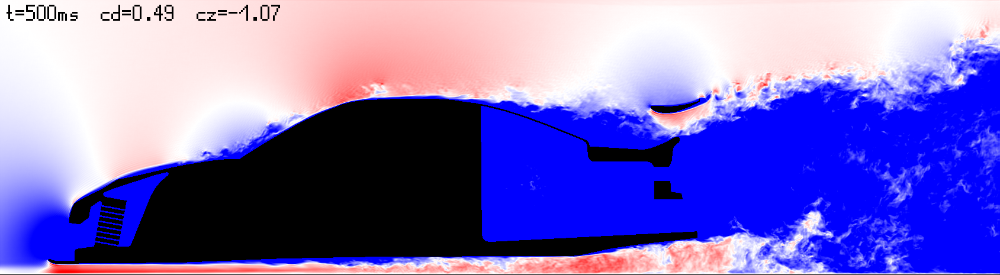
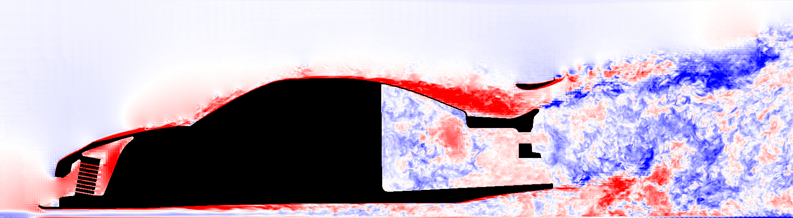

# FluidX3D — Intel Arc Pro B70: Vehicle Aerodynamics (LBM-WMLES vs. OpenFOAM)

**Performance & results at a glance** *(all numbers measured on this rig. Forces from the 4 mm
production run `p4dt_deteps` (2026-09-11), the current baseline: facet SISM wall model, ghost-mode
purification (P-TRT, ω_g = 1.90) and the det-ε rank guard. N = 300, window t ≥ 0.201 s, uncertainty
= standard error over six 50 ms window means. Cd/Cz are the **rest** figures — the moving z-band
around the wheel contact is split off, because the floor imprint produces ≈ −0.7 of purely
artificial downforce — plus the friction path. Memory and throughput at 4 mm, 519 M fine cells on
the B70 + 203 M coarse cells @ 16 mm on the iGPU, 501 ms physical.)*

| Metric | Current baseline | Reference |
|---|---|---|
| **Cd** = pressure (band removed) + friction | **0.5651 ± 0.0131** | OpenFOAM 13: 0.599 → **94.3 %** |
| **Cz** = pressure (band removed) + friction | **−0.9635 ± 0.0222** | OF13: −1.301 → **74.1 % of the reference downforce** |
| **Wall-model coverage**, real wall cells | **93.85 %** | was 82.5 % before the det-ε rank guard |
| **Free velocity outliers** > 60 m/s, t = 501 ms | **91** cells, max 77 m/s | was 6 270 cells, max 275 m/s before ghost-mode purification |

Both force figures are **total** coefficients, because the OF13 reference is one. Their composition,
so that no number here can be confused with another:

| Component | Value | |
|---|---|---|
| `cz_druck` | −0.8238 | pressure including the wheel-contact z-band |
| `cz_druck_band` | +0.2176 | that band alone — the floor imprint, **an artefact**, which is why it is split off |
| **`cz_druck_rest`** | **−1.0414** | pressure without the band. **This is the quantity every model comparison in this document is measured on** |
| `cz_reib` | +0.0779 | friction, and it works *against* downforce |
| **Cz total** | **−0.9635** | `cz_druck_rest + cz_reib` — the row in the table above |

Model effects are quoted on `cz_druck_rest` throughout, because the friction path responds to these
models with the opposite sign and would dilute the signal. The comparison against the reference
needs the total.

> **What the September 2026 work did and did not buy.** The integrated forces are, within the error
> bars, where they were before: Cd 0.5747 / Cz −0.9687 on the previous headline arm (`km_s4_sism`,
> 2026-09-08). What changed is the **field** and the **wall-model reach**. The velocity outliers
> that made the 4 mm field locally unphysical are gone (6 270 → 91 free cells above 60 m/s, peak
> 275 → 77 m/s), and the wall model now reaches 93.85 % of the real wall cells instead of 82.5 %.
> Those two are measured on field data and on visit-weighted counters, not on the force estimator.
> **The remaining downforce gap against OF13 is therefore not explained by either of them** — it is
> still the open question of this project.

| Metric | Value | Context |
|---|---|---|
| **Wall clock, 4 mm production** | **90.4 min** for 501 ms physical | was 94.5 min; the 11.09. performance audit bought 4.4 % with forces unchanged inside the error bars |
| **B70 kernel (8 mm screening rung)** | **+63 %** vs. the pre-optimisation era (939 → 1 534 displayed) | ratio only — see the display-convention note below |
| **Dual-GPU overlap** | **CONCURRENT 96.1 %** | B70 93.9 % busy @ 2.5 GHz mean, iGPU 91.0 % (fdinfo profiler, 180 s) |
| **VRAM (4 mm production)** | **27 695 / 32 655 MB**, 4 921 MB free after coupling and shell are bound | was 28 003 MB. The printed peak used to fall 300 MB too early — before `kf_liste` binds — and that is fixed |
| Single-domain B70 baseline | ≈ 5 464 MLUPS | measured in the **predecessor fork** (V1, `MODIFICATIONS.md:251`, 337.5 M cells, no wall model) |
| **Near-field kernel, true rate** | **≈ 5 028 MLUPs** | dual-domain v2 today, corrected for the display convention — 8 % below the V1 bare baseline, with the whole wall-model chain on top |

> **Instruction counts are not a runtime measure here — measured twice on 2026-09-11.** An arm
> with **2073 fewer** instructions in `stream_collide` ran **2.46 % slower**; a Spalding lookup
> table with **−4.57 %** instructions changed the wall clock by **nothing**. What does show up is
> **atomics on shared buffers**: thinning the diagnostic counters bought 12 s, a shared counter
> cadence another 6.5 s, and dropping the class-diagnostics buffer 5 s — each paired-measured on
> the 8 mm rung. Any optimisation proposal in this repo that rests on an instruction count alone
> is treated as unproven until a wall clock says otherwise.

> **Display convention — read this before quoting any MLUPs or GB/s number from a log.** In a
> dual-domain run the progress line divides the **coarse** cell count by the **fine** step time.
> `Info::print_update` uses `lbm->get_N()` (`src/info.cpp:119`); `info.lbm` is left pointing at the
> far field because `lbm_c.run(0u)` initialises last (`src/setup.cpp:7045`), while `info.update` is
> only ever called from `LBM::run` (`src/lbm.cpp:2447`) and the time loop runs `run()` for the near
> field alone — the far field uses `run_async`, which never reports a time. The displayed figure is
> therefore too small by **N_far / N_near = 2.551** at 4 mm and 2.561 at 8 mm. **Ratios between two
> runs stay valid** (both arms carry the same factor); absolute values do not. Corrected: the 4 mm
> near-field kernel runs at **≈ 5 028 MLUPs**, not 1 946.

> **On an older headline figure.** Earlier versions of this file led with Cd 0.805 / Cz −1.180 from
> the run `f4_vollumfang_mls` (2026-08-27). Those were *post-hoc artefact-corrected* values whose
> correction chain is not reproducible from the surviving record — that run's raw log reports
> Cd = 9.87 with phantom forces at facet-treated links. The table above uses the in-code force
> decomposition instead, which every run since produces directly and identically. The two are not
> comparable, and the older pair has been retired rather than carried forward.


*Current baseline (`p4dt_deteps`, 2026-09-11): Toyota MR2 at 30 m/s (Re ≈ 9 M), near-field |u| at
t = 500 ms (15→45 m/s blue→white→red, black = solid). Engine bay with radiator fins resolved, rear
wing attached, full turbulent wake. This is the first 4 mm field without the isolated velocity
spikes that marked every earlier production run: **91 free cells above 60 m/s instead of 6 270, and
a free maximum of 77 m/s instead of 275** — the latter had been sitting at the velocity clamp.*


***The baseline against the OpenFOAM 13 reference** on the Y = 0.025 m slice: ΔU = |u|_OF13 − |u|_FX,
red = OF13 faster, blue = OF13 slower / FX over-accelerated, ±15 m/s, black = solid. The over-roof
over-acceleration that defined V1 is reduced to a pale shadow; the red rim hugging the body is the
boundary layer (the wall model brakes slightly harder than the RANS reference), and the mottled wake
is the snapshot-vs-mean caveat (FX is an instantaneous LES field, OF13 a RANS mean — resolved eddies
against a smooth average; the mean-flow regions are the meaningful comparison). Field statistics of
this diff (636 437 evaluable cells, alignment per the established frame mapping
x_v2 = x_OF13 + 2.2063): **RMS 4.26 m/s, median −0.57 m/s, only 1.66 % of cells clip the ±15 scale**
— against RMS 5.1 / median −2.2 / 1.8 % on the previous headline run.*

A fork of [ProjectPhysX/FluidX3D](https://github.com/ProjectPhysX/FluidX3D) tuned for **vehicle
aerodynamics on a single Intel Arc Pro B70 (Battlemage) + Arrow-Lake iGPU**. The base solver runs
at **≈ 5 464 MLUPS** on the B70 via OpenCL (measured in the predecessor fork, single-domain). On top of that this
fork adds a force-resolving, multi-resolution dual-GPU stack for a Toyota MR2 race car, validated
against an OpenFOAM 13 k-ω-SST reference (34 M cells: **Cd 0.599 / Cz −1.301**) on the **same STL**.

This is the **second generation (V2)** of the fork. The first generation — the B70-Pioneer work
from May to August 2026 — was retired on 2026-08-15 and rebuilt from scratch under hard working
rules; the reasons are in *Why V2 instead of the old fork* below. Everything under
*Carried over from V1* is taken from that first generation **unchanged**: those findings are still
valid and still the ground the current work stands on.

- Upstream docs: [README_UPSTREAM.md](README_UPSTREAM.md) · license **unchanged** (non-commercial /
  non-military): [LICENSE.md](LICENSE.md)
- **Branch policy:** single-branch, all work on `master`.
- **The README is the current state only; the method documents below carry the detail** (they are
  in German). The chronological audit and acceptance record is kept as an internal working
  document and is not published.

---

# V2 — the rebuild

## Why V2 instead of the old fork

The first fork (V1) had grown exploratively over months: mechanisms without proof of effect (the
central moving-floor fix turned out to be a **silent no-op for years**), mixed measurement arms, no
reproducible chain of evidence. V2 is the disciplined rebuild of the same task under hard working
rules ("Iron Rules"):

1. **Every mechanism proves its effect in the binary** — action-path counters, is=should acceptance
   tests, self-checks. A switch without a firing counter is a hard error, not a detail.
2. **Two-stage review** — a planning/pre-check review before and an independent adversarial
   review against the diff after every implementation; correction loops until "no findings".
3. **One variable per run** — screening on the fast 8 mm rung (~10 min/run), production (4 mm) only
   for validated winners.
4. **One runner, one chain, one watchdog** — GPU series start only through a locked queue with a
   status file.
5. **Measure on data, never on pictures** — field CSVs and probes, never rendered images. A picture
   shows what the renderer made of it, not what was computed.

## What this fork changes vs. upstream FluidX3D (updated 2026-09-03)

Upstream is a general-purpose LBM solver that already runs at **96–100 % of peak memory bandwidth**
— the fastest of its class. Nothing below tries to improve on that. Everything was added or
replaced for one purpose: **resolving forces on a road vehicle, at a resolution that fits on one
workstation GPU, on Intel hardware, and being able to prove every number.**

All figures are measured on this rig unless a literature source is named. Changes that were built,
measured and then **rejected** are listed too — a rejection backed by numbers is a result, and
keeping it visible is what stops it being re-proposed.

### 1 · Geometry

| Change | Why | Measured effect |
|---|---|---|
| **SAT voxelizer** (`CFD_SAT`) — on top of the ray-parity bulk, add every cell any STL triangle intersects (exact Akenine-Möller triangle–box overlap), then `CFD_FILL_VOIDS` seals interior air pockets | Ray-parity drops any feature whose entry and exit crossing land in the same cell — a plate thinner than one cell simply vanishes. On a race car that is the wing end-plates, the splitter, the louvres | At 4 mm this resolves wheel spokes, brake ducts, diffuser strakes, underfloor channels, wing + Gurney, splitter, canards, hood louvres, mirror. Conservative and surface-accurate: nothing thin lost, nothing over-thickened. **Staircasing is no longer a credible error source at this resolution** |
| **The voxel body is the only wall truth** — no geometric quantity is ever re-derived from the STL after voxelisation | Voxelisation thickens; an STL-derived normal and a voxel-derived normal then disagree, and the wall model silently mixes two geometries | Project rule since 2026-08; wall distance, normal and link occupancy all come from the same voxel body |

### 2 · Wall model — the facet chain (upstream has none)

| Change | Why | Measured effect |
|---|---|---|
| **Cell-based facet model (iMEM)**: TLS surface fit across the voxel staircase → Spalding target → 3×3 momentum solve for a slip velocity, with a saturation gate | Plain bounce-back on a 4 mm grid is a hydraulically rough wall, and the stair-step normal is not the surface normal | Vehicle Cd 0.818 (BB) → **0.728** (8 mm arm `s5b`); action path proven at 1.3 G events, is=should exact |
| **ELIBB** link-wise geometric boundary on top: a Surface-Nets remesh supplies per-link wall distance q; the q > ½ branch is the **MLS χ-blend**, χ = (2q−1)/(τ₀+½) | Sub-cell wall placement instead of stair-step. The predecessor branch was spectrally unstable — λ_krit = 4(2−ω)/(ω−1), derived and then measured | **10.9 M cut links on 2.62 M facets** at 4 mm, **zero fallbacks**; stable to ω → 2, q = 1. Both branches carry their own counters (894 M / 1.68 G firings, is=should exact) |
| **Wall-model input taken from the second fluid cell** (`CFD_FAC_NACHBAR`), replacing an empirically fitted 3/2 factor | The first cell is bounce-back-deflated (P₁ ≈ −u/3) **and** sits in the stair shadow. The fitted factor was calibrated on one geometry at one resolution | Plane channel: u_τ factor **0.696 → 0.920**, c_f 1.653e-3 → **2.748e-3** (+66 %, 38 σ; Lee & Moser 3.442e-3 → coverage 48 % → **80 %**). Per-class scatter of tw/target **1.26 → 1.02**; a *global* factor made it worse (1.34) |
| **Mass correction α = 2 + saturation gate** on the facet momentum exchange | The facet model injects momentum; without the correction it also injects mass, and the leak **grows** with resolution | Sphere, Δm 458.7 → **−1e-6**; the uncorrected arm's leak scales 272 (D/dx 11) → **13 149** (D/dx 37.5) — the correction gets *more* important toward the vehicle, not less |
| **Wall-model coverage fix** — y_w clamp instead of discard, plus a coherence edge test | 19.9 % of all wall cells had no wall model at all and nobody noticed | **19.9 % → 4.5 %** (4 mm: 146 198 of 3 275 383 cells) |

### 3 · Subgrid model

**Active in the baseline:**

| Change | Why | Measured effect |
|---|---|---|
| **`CFD_SGS_FDWAND`** — at facet cells, ν_t comes from a finite-difference \|S\| of the velocity field instead of from the Π-tensor | The wall model writes non-hydrodynamic populations into the local distribution, and Smagorinsky builds its tensor from exactly those | Π/FD = 2.3–3.4 at applying wall cells; the substitution removes a factor that has nothing to do with turbulence |
| **`CFD_SGS_SISM`** — shear-improved Smagorinsky (Lévêque et al., *JFM* 570, 2007) on facet cells: ν_t = c²·max(0, \|S\| − \|⟨S⟩\|), with ⟨S⟩ an exponential moving average of the six tensor components per facet (24 B each, T = 50 ms) | Near a wall the strain rate is dominated by the *mean* shear, which is not turbulence. Subtracting it is the one correction of the five tested that moves the forces | 4 mm, paired, N = 300: **cz_druck_rest −0.1017 ± 0.0099 (10.3 σ)** — closes **29 %** of the remaining lift gap. The clamp at zero is mandatory: without it τ drops below ½ |

Both carry effect-path counters, self-tests against literature values, and a host-side is=should
report; the EMA additionally has a drift watchdog that judges the measurement window at run end.

**Available but not in the baseline** (kept switchable so the measurement can be repeated rather
than believed — each was built, accepted bit-identically in its control arm, and then measured):

| Switch | Verdict | Number that decided it |
|---|---|---|
| `CFD_SGS_VANDRIEST` — D = 1 − exp(−y⁺/A⁺), ν_t ← ν_t·D², y⁺ from the wall model's own τ_w running mean rather than from the local strain | rejected | 4 mm, paired, N = 300: **cz_druck_rest −0.0004 ± 0.0035 (0.1 σ)**, despite lowering ν_t by 23.6 % on average. Its criterion is the viscous sublayer; the first fluid cell sits at a median y⁺ of 75 (4 mm) / 141 (8 mm), so it damps where the layer is thin and does nothing where separation decides lift |
| **`CFD_FAC_DETEPS`** — noise floor in the full-rank test of the coupled Schur branch (2026-09-09) | **the fallback was largely a rounding artefact** | For the flat voxel link set, `G'` after the ALPHA2 downdate is exactly `(1/3)(I − m mᵀ)`, the Schur complement has rank 1 and `dett` is **analytically zero**; the relative threshold `1e-4·Gt11·Gt22` falls *below* the float noise as `Gt11 = (1/3)sin²ψ → 0`. The cell then takes a full-rank branch that does not exist and divides by noise (s1 becomes 1e4…1e7 times u_t), so both gates fire — correctly. Three independent proofs: 93.34 % of all gate fallbacks come from that branch (rate 45.82 % against 2.79 % in the PINV branch below it); the fallback rate against tilt angle **jumps from 1.5 % to 92.7 % at exactly 1°**, where the cancellation guard `kernel.cpp:2193` stops protecting; and the branch migration is exact (−8,686,532 out of [79], +8,686,532 into [80]). 8 mm coverage of real wall cells **70.51 → 81.83 % (PINV) → 95.03 %**, target class (tilted 5-link cells: roof, bonnet, rear deck) 46.81 → **1.98 %** fallback. Cost: 5 operations, 0 MB. Default 0 = bit-identical. **Forces not yet cleared — the 4 mm run carries an unresolved defect (isolated velocity spikes at the nose, absent at 8 mm).** |
| `CFD_SGS_BAND` — SISM extended to wall layers 2 and 3 over a dedicated cell list | **no gain, settled on both rungs** | 8 mm, paired against layer 1, N = 129: **cz +0.0093 ± 0.0077 (1.2 σ)**. 4 mm, paired against layer 1, N = 300 (`vd4_band3` vs `km_s4_sism`, 2026-09-09): **cz_druck_rest +0.0059 ± 0.0038 (1.5 σ)**, cd_druck_rest +0.0011 ± 0.0036 (0.3 σ) — same sign, same insignificance, so the coarse rung did **not** mislead here. Against no model at all the two are indistinguishable: layer 1 alone −0.1013 ± 0.0107 (9.4 σ), all three layers −0.0954 ± 0.0123 (7.7 σ). The effect path fires exactly (slot 186 = 5,191,900 band cells × 501 count slots, 0.10 % deviation), so this is not a silent no-op. **Why it does nothing is visible in the clamp**: SISM's ν_t=0 clamp fires 343,598,618 times with the band against 348,029,393 without it — a factor of 0.987, even though 2.66× as many cells are in the denominator. Outside the first wall cell \|S\| almost never falls below ⟨\|S\|⟩, so the model has nothing to subtract there |
| WALE, Sigma, Vreman, AMD | not built | Ω is not a moment of the local distribution (the D3Q19 Π-tensor is symmetric by construction), so each needs central differences, a separate launch and a field per cell (519 MB at 4 mm). Measured offline on identical fields, their ratio is spatially white noise (stride-1 correlation 0.13–0.40 against 0.92 for \|S\| itself) and ν_t would jump by more than a decade against the face neighbour in 30 % of interior cells |

> **A warning about the coarse rung.** At 8 mm, SISM appears to halve the pressure drag
> (cd_druck_rest 1.0709 → 0.5603, 70 σ). At 4 mm the same measurement gives **+0.0051 (1.4 σ)**.
> The 8 mm geometry has 9.0 % of its facets on one-cell-thick parts against 0.7 % at 4 mm — the
> model is repairing a **geometry artefact** of the screening rung, not physics. The coarse rung is
> sound for stability, effect-path and wall-shear screening; not for pressure-side verdicts.

### 4 · Numerics and number format

| Change | Why | Measured effect |
|---|---|---|
| **FP16S** (range-shifted) as the production DDF format, chosen against FP16C and an FP32 arm | Both FP16 variants cost 2 B/DDF; the open question was which one the wall model tolerates | **1373 (FP32) → 1924 (FP16C) → 2246 MLUPS.** FP16S is not only faster but *closer to FP32*: c_z error under FP16C −0.0119 at 2.17 σ, under FP16S +0.0038 at **0.70 σ** |
| **SRT retained — TRT deliberately rejected** (decision 2026-06-08, re-confirmed since) | TRT is the standard recommendation for exactly this regime, which is why the rejection is recorded rather than left implicit | At τ ≈ 0.5 the odd mode relaxes at ω_m ≈ 3.7e-5 — **~27 000 steps** — and the run diverges. Measured ranking: TRT Λ = 3/16 is *worse* than SRT on the inlet ringing metric |
| **D3Q19 retained.** D3Q15/D3Q27 examined for the wall model's link budget (2026-09-03, corrected the same evening) | The natural suspicion was that the wall model falls back for lack of links | It falls back **because of** links: the ALPHA2 down-date replaces the second moment of the link directions by their *covariance*, so the solve needs the directions to **spread** — full rank requires ≥ 3 links (≥ 4 when coupled). At one link, mass conservation forces the injected momentum to vanish identically, under any scheme. **44 % of all fallbacks are this rank floor and are unreachable**; the rest is a saturation gate, not a link count. D3Q27 *would* buy rank — it is rejected on memory alone (+27.3 % ≈ 8.3 GB) |
| **Improved-equilibrium (D3Q19-I) and HRR examined → rejected** (2026-09-03) | Cheapest conceivable accuracy lever, so it had to be checked to code level | D3Q19-I changes exactly one fourth-moment term (ΔΠ_iijj = u_k²/6); on the plane channel its effect is **exactly zero** by a homogeneity argument, and the vehicle upper bound is **0.01–0.26 %** against a 27 % deficit. HRR would add a free hyperviscosity knob next to Smagorinsky. Verdict: hygiene, not a lever |

### 5 · Domain architecture and device scheduling

| Change | Why | Measured effect |
|---|---|---|
| **Dual-domain**: fine 1689 × 661 × 465 @ 4 mm (519 M cells) on the B70 inside coarse 768 × 480 × 552 @ 16 mm (203 M) on the iGPU, far → near TYPE_E coupling with a cubic boundary lift | A single 4 mm box large enough for a correct wind-tunnel blockage does not fit in 32 GB — and a box small enough to fit distorts the pressure field | Coupling costs **0.8 % of step time**; far-field blockage **2.74 %** (OF13 reference 1.93 %) while the near field stays at 4 mm. Forward RMS \|Δu\| 1–3 % of freestream ahead of the nose |
| **near → far feedback bands** (wall-free band variant: profile/plateau shaping, wake band, band start ≥ 2 coarse cells off the body) | One-way coupling lets the far field run a car-less flow and feed it back in | Built and instrumented; interface pressure and coverage-point verification chain on board |
| **Genuinely asynchronous two-device scheduling** — `run_async` + an explicit `clFlush` per domain queue (2026-08-20) | Without the flush the coarse step only starts at the next blocking call: the overlap existed, but as **driver luck** (NEO auto-submit), and the host timer books the far wait onto the fine phase | fdinfo profiler, 180 s mid-run: B70 CCS-busy **93.9 %** @ 2512 MHz, iGPU compute-busy **91.0 %**, **CONCURRENT 96.1 %**. Phase split: fine step 97.7 %, forces 1.1 %, coupling 0.9 %, far wait + extract 0.3 % |
| **Performance index** (wall seconds per physical second) instead of MLUPS as the reporting metric | With two domains the MLUPS console figure is meaningless — it mixes the coarse cell count with the fine step time | V1 ≈ 12 000 → V2 **≈ 9 100** at identical configuration and hardware (**−24 %**), and V2 does *more*: `UPDATE_FIELDS` is on, which costs 10–15 % throughput |
| **iGPU characterised over case size and grid shape** (12 + 5 arms, one variable each) | Two planning constraints were treated as law: "coarse Nx always ÷ 64" and "avoid large cases on the iGPU" | 15.5× in cell count → **1.7 % spread** in ns/cell, no trend, no jump at the 4095 MB buffer limit. Grid-shape spread also 1.7 %. **Both constraints cost nothing and buy nothing** on today's stack — far-field sizing is now driven only by compute time and blockage |

### 6 · Boundary physics

| Change | Why | Measured effect |
|---|---|---|
| **Moving-floor equilibrium reset** (near + far, upstream/downstream split at the nose) | The far-field floor ran in a staggered period-2 mode at τ ≈ 0.5 that killed the under-body flow. In the predecessor fork the "fix" for this had been a **silent no-op for a year** | Its own reset counters, mandatory is > 0 at run end. Profile 1.216 at the nose (x ≈ 1.29 m) |
| **Inlet equilibrium reset + damping zone + pressure outlet** | Inlet ringing contaminated the freestream | Freestream streaks **−99 %** |
| **Tyre-contact force split** (moving z-band artefact separation) | The floor imprint at the contact patch produced downforce that is not aerodynamic | The imprint was worth ≈ **−0.7 Cz of artificial downforce** — quantified, then removed from the reported coefficients |

### 7 · VRAM

The 4 mm production point (519 M fine cells) used to sit at **29 672 MB of 32 655** — measured
externally, the reference arm dips to **3 MiB free**. Every item here is what makes the case fit at
all. As of 2026-09-08 the same point runs at **27 452 MB with 3 168 MiB measured free**, i.e. the
levers below have bought back **2.1 GB beyond** the 2.4 GB of the September batch, at no throughput
cost (performance index within 0.11 %).

Two of them are worth spelling out because they are the kind of thing that hides in plain sight:

- **A finished, accepted switch that was never set.** The force-field marker list had been accepted
  at the 4 mm production point on 2026-09-03 with 17/17 bit-identical result CSVs and +1 709 MiB
  measured — and then sat in no configuration for five days, because it was accepted as a *finding*
  and never promoted to *baseline*. It is now in the baseline file with its full acceptance record.
- **A pre-flight that undid its own gain.** The constructor's memory estimate booked the force field
  at full size regardless of the switch, i.e. 1 832 MiB for a buffer that is really 43 MiB. The
  memory was free at runtime but the ceiling kept rejecting grids that would have fit. Found by the
  independent review of the very commit that saved the memory.

| Change | Why | Measured effect |
|---|---|---|
| **Force field F over a bounding box** instead of the full grid | F is only needed where the body is; upstream allocates it over every cell — and the constructor pre-check *also* computed it over the full grid and rejected grids that actually fit | F on 1118 × 468 × 306 instead of 519 139 485 cells → **4.31 GB saved** (run log) |
| **Block-Tiling of the DDF buffer `fi`** — allocate only tiles that are not fully solid (plus a 2-cell halo), with workgroup = tile so the own-cell base needs no lookup | `fi` dominates LBM memory (19 × FP16 × N ≈ 19 GB); a solid car occupies many cells whose DDFs are never streamed | **in v2 today: 1.43 GB freed at −40 %** (2624 vs 4348 MLUPS dense, `CFD_TILE=8`). The workgroup=tile dispatch that brings this to −12 % (and T=16 to −9 % for 0.77 GB) exists **only in V1** and is not ported here — see the section below |
| **Smoothing index over the facet bounding box** | Full-grid allocation for a quantity that only exists near the surface | **593 MB instead of 1980 MB** |
| **Two-stage memory plan with a hard pre-flight check** | Running out of VRAM 40 minutes in wastes a slot on a single-GPU machine | The plan predicted the production run **to the megabyte**: 29 673 MB predicted vs 29 672 MB in the run log |
| **Host-mirror release with guards** (`delete_host_buffer`, 2026-09-03) | Freeing a host mirror left dangling aux pointers and a live zero-copy device buffer — a trap for exactly the VRAM work queued next | All ten transfer overloads now refuse to run on a released mirror; zero-copy release is a hard error. Proven by negative tests, both arms bit-identical to the reference run |
| **`fac_idx` as a bitmask + block prefix sum** (2026-09-03): one `uint` per force-BBox cell replaced by a packed pair per 32 cells — `fid = base + popcount(mask below own lane)` | 610.8 MiB of VRAM (and the same again in system RAM) for an occupancy of 1.95 % | Facet buffers at 4 mm **1022 → 449 MB**. Integer-exact, therefore **bit-identical**, and proven so at every rung: CPU 5/5, iGPU 5/5, B70 8 mm 19/19, **4 mm production 17/17** |
| **F as a wall-solid marker list** (2026-09-03): F allocated only for solid cells that have at least one non-solid neighbour, addressed through the same bitmask machinery | At 4 mm only **3 739 681 of 62 724 296** solid cells are wall cells — F was carrying 12 B for each of 160 M box cells | F **1832 → 81 MiB** (near) and 32 → 3 MiB (far). Bit-identical at every rung; an action-path counter proves every cell the kernel writes has a slot (0 misses) |
| **Index lists from 64-bit to 32-bit** (2026-09-08): six cell-index lists (force cells, FD-wall cells, shell cells, pressure-outlet cells) — the kernel computes in 32-bit anyway whenever N < 2³², and cast the loaded 64-bit value away immediately | Half the memory for identical values, identical order, identical grouping — bit-identical by construction | **259 MB**, control arm bit-identical |
| **Shell buffers as 1-element dummies in the near field** (2026-09-08): the blend input and its weights are read by exactly one kernel, and the near field never blends | Allocating a buffer for a code path that provably never runs | **28 MB**, plus a guard that turns the mistaken write into a hard error |
| **Measured at the 4 mm production point** (same binary, one variable per step, all three arms 17/17 byte-identical) | The two levers above, measured rather than computed | Free VRAM (`visible_avail`, sampled externally): **150 → 1160 → 2928 MiB mean**, minima **3 → 740 → 2449 MiB**. The reference arm ran with **3 MiB to spare** — which is why every box extension had failed on memory. Performance index 10700 → 10691 → 10688: **no cost** |

### 8 · Performance engineering on Battlemage

Chain result on the 8 mm screening rung: **939 → 1534 MLUPs (+63 %)**, same-env A/B throughout.

| Change | Why | Measured effect |
|---|---|---|
| **IGC unroll-budget fix** | A grown kernel loop silently exceeded IGC's unroll budget; runtime-indexed private arrays went memory-resident and every DDF access ran through scratch | `private_size` 4256 B/WI → **0**; **~100×** on the affected arm. Found **offline** via ocloc/zeinfo — no runtime symptom pointed at it |
| **`store_f` rematerialisation** | Register spill from address CSE across the facet block | +3.0 % B70 kernel (1478 → 1523), spill 448/832 B → **0** |
| **F-buffer null-read gate** | Skip reading a force field that is provably +0 at non-solid cells | +0.7 % (1523 → 1534), guarded by a host-side invariant scan at init |
| **GPU-side force reduction** instead of 2.5 GB PCIe transfers per force window | The force window, not the solver, was the bottleneck | Force-window share **36 % → 1.3 %** of step time (~13 % wall clock at production cadence) |
| **Slice plane-gather** — read one plane instead of full fields at slice events | Slices moved 11.3 GB per event over PCIe | 11.3 GB → plane-sized transfer; slice windows +12 % on the outer step instead of dominating it |
| **Offline scratch/spill gate in CI** (`werkzeuge/scratch_gate/`) — ocloc-compile the real kernel for both GPUs on every change | The 100× class of regression is invisible at runtime until someone benchmarks | `private_size = 0 AND spill_size = 0`, or the gate fails the commit. The class can never return silently |

#### The 2026-09-11 performance and VRAM audit — one working day, seven measures adopted

Five agents mapped the whole code per kernel and per buffer; every adopted measure was then
**paired-measured on the 8 mm rung** and confirmed together on the 4 mm production run.

| Measure | Gain (8 mm, paired) | Physics |
|---|---|---|
| Scratch fix in `fac_nachbar_ab` — one runtime-indexed table read moved into the loop | `private_size` **7296 → 0** (B70), **3648 → 0** (iGPU) | bit-identical |
| Smoothing index → sorted list + binary search | −581 MB host RAM | bit-identical |
| Free the ELIBB remesh map after use | −174 MB host RAM | bit-identical |
| *(the three together)* | **−11 s wall clock, −187 MB RAM** | 28/28 files bit-identical |
| P-TRT counter gate `t%100 → t%1000` | **−12 s = −2.9 %** | 28/28 bit-identical |
| **Spalding lookup table** (512 nodes, `__constant`) | speed **±0**; systematic friction offset **−69 %** | changes numbers, measurably better |
| **Shared counter cadence** — one constant for 71 kernel gates *and* 12 host expected-value formulas | **−6.5 s = −1.61 %**, ranges disjoint | 27/28; the one file is the counter trace itself |
| `CFD_FAC_KDIAG=0` | **−191 MiB VRAM**, −1.26 % | forces and field bit-identical |

**On the 4 mm production run together: 94.5 → 90.4 min (−4.36 %), VRAM 28 003 → 27 695 MB, with
Cd_rest and Cz_rest inside the error bars** — even though the SGS band was switched off and the
Spalding inversion was replaced.

**Three latent guard defects were fixed in the same pass**, all found by an adversarial VRAM
review and none of them cosmetic:

- The printed memory **peak was not the peak**. `setup.cpp` claimed the build was complete and
  three lines later allocated the coupling planes, then the shell — and `kf_liste` (237 MB at
  4 mm) binds only inside the time loop. **The true peak falls after every guard has passed**:
  a run could survive the whole build and die 260 MB later.
- The memory plan knew **only `fac_idx`** of the entire facet chain — 596 MB stood in no term
  and no reserve. That the balance still came out right was luck, not arithmetic.
- `alloc_sgs_band` checked **no free memory at all**, while its immediate neighbour does.

**Five claims were refuted**, three of them from this project's own analysis:

- Removing the volume force would have been a silent break: it is *not* dead — the wall-model
  residual is injected through the same Guo chain, and `CFD_FAC_KRAFT` would have become a
  no-op without any error. That is the exact failure class that kept V1's moving-floor fix
  inert for years.
- Mixed tile sizes save **provably zero** on the DDF buffer (`Σ children ≤ T³`); 64³ and 128³
  *cost* 3.8 and 6.7 GiB of rounding padding.
- Two headline numbers in this README came from **V1**, not from v2 — corrected in place.
- The claim that the facet moment matrix is pure geometry is wrong: its tangential basis comes
  from the local velocity and turns every step.

**The scratch gate itself was the sharpest finding.** It had checked exactly one kernel since
it was built, because the kernel name was hard-wired in the offline-compile wrapper — which is
precisely why the scratch in `fac_nachbar_ab` went unnoticed. It now checks **all 37 kernels on
both devices**, carries declared exceptions as named debt with a fix path, and reports an entry
as stale once it no longer applies. Both new guard functions paid for themselves the same day.

### 9 · Intel platform robustness (B70 / xe / Arrow-Lake)

| Change | Why | Measured effect |
|---|---|---|
| **`_exit(0)` after the last export** | On `xe`, unmodified FluidX3D `SIGSEGV`s during C++ teardown (`Timedout job` / `Fault response -EINVAL`, then double free) | Data flushed before teardown is intact; the workaround is a one-liner and documented so it can be retested on a future driver |
| **i915 GEM-BO leak documented + avoided** | Killing a run mid-flight on the iGPU leaks **12–16 GB per kill** and accumulates until the system OOMs — the B70 (`xe`) is not affected | Detection via `Active(anon) − AnonPages − Shmem`; mitigation is to always run to completion. This is why GPU runs go through a locked queue |
| **Zero-copy threshold** (`ZEROCOPY_THRESHOLD_MB`) | On Intel NEO, zero-copy buffers above ~1 GB spin | Threshold switch lets NEO fall back to a normal device buffer above N MB |
| **Zero-copy blocking-read fix** (iGPU) | All eight read/write wrappers now finish the queue correctly | Correctness, and removes silent stalls on the far domain |
| **fdinfo-based GPU profiler** | `intel_gpu_top` works only on the iGPU — the `xe` driver has no i915 PMU, so the B70 is invisible to the standard tool | Root-free per-device utilisation from `/proc/<pid>/fdinfo`: `drm-cycles-ccs` on `xe`, `drm-engine-compute` on i915. This is what produced the 96.1 % concurrency figure above |

### 10 · Validation rigs (all added by this fork)

| Rig | What it settles | Result |
|---|---|---|
| **Sphere resolution ladder** (`kr_dx*`, D/dx 11 → 37.5) | Does the facet chain beat plain bounce-back on a body whose drag is known from experiment? | Conservative arm converges monotonically from below to **Cd 0.436** at D/dx 37.5, against the **0.45–0.5** subcritical reference band (Achenbach), while the BB baseline sits at **0.717 — 50–60 % over**. Honest limits recorded with it: Re_D = 9.1e5 is nominally supercritical, and 18 → 37.5 still lifts by +0.08 |
| **Plane channel, N = 20** (`kipp=0`) | The wall model against a case with a literature answer | u_τ factor and c_f against **Lee & Moser**; this is where NACHBAR was measured (48 % → 80 % of the reference c_f) |
| **Tilted channel torus, `CFD_KANAL_KIPP` = 0 / 26.565° / 45°** | Isolates the *staircase*: the same physical wall presented to the grid as flat, as a 2:1 stair and as a 45° stair, y-periodic so there is no entry length | Per-stair-class tw/target — the diagnosis that a *global* sampling factor cannot fit a staircase (classes 0.31/0.20/0.16 → 0.54/0.48/0.49 with NACHBAR). **Deliberately recorded limit:** cross-arm c_f comparison is *invalid* — the tilted wall is a genuinely rougher wall (u_τ differs by 2.9×), a flaw in an earlier experiment design that is kept on record |
| **Paired A/B against OpenFOAM 13** (34 M cells, k-ω-SST, **same STL**) | Physics, as opposed to porting errors | Reference **Cd 0.599 / Cz −1.301**. Validating against an earlier version of one's own code is banned by project rule — it can only find porting errors, and it confirms shared mistakes |

### 11 · Instrumentation and proof of effect

| Change | Why | Measured effect |
|---|---|---|
| **~80 action-path counters with is=should assertions**; a switch without a firing counter is treated as a hard error | In the predecessor fork a central fix had been a silent no-op for a year, and mechanisms were believed to work because they were merged | Several switches were caught as silent no-ops **before** any result rested on them — including, on 2026-09-03, one whose own guard was itself a no-op (it sat behind a silent zeroing) |
| **Bit-anchor field hash** and byte-comparison of result CSVs | Determinism is the acceptance tool: an arm that cannot be reproduced bit-for-bit cannot be accepted | Caught `CFD_FAC_NACHBAR` reading `u` in the same launch that writes it — "t−1 or t depending on scheduling". Rebuilt as its own kernel after the finished field; repeat runs now bit-identical |
| **Block-SEM statistics** on every force window | Separating a real effect from window noise needs an error bar, not two numbers | The 38 σ on the NACHBAR channel result, and the 15-block-SEM separation of the wall chain's Cz contribution |
| **Per-stair-class wall diagnostics** (`CFD_FAC_KDIAG`), y⁺ histograms, displacement census, interface pressure, force decomposition | Global end numbers hide which cell class is wrong | Six instruments were themselves found **measuring wrong** and fixed — e.g. a y⁺ histogram off by a factor of 18 |
| **Saturation protection on every counter** | At 4 mm a per-step counter reaches 1.57e9 — 37 % of the uint range — within one run | The pre-run prediction matched the production run exactly (slot 76 = 1 567 721 685) |

### 11a · What the acceptance chain actually caught (2026-09-08, one working day)

Every mechanism here is built the same way: a planning pass before the first line, an independent
review against the diff afterwards, and a bit-identical control arm. That day is a fair sample of
what the chain is for — three of these would have computed silently wrong numbers:

- **An acceptance test comparing the wrong two things.** The van Driest ist=soll compared a *time
  integral* over all sampling slots against the host's *end state*. At the sharp channel rung the
  distribution sits on a bin boundary, so a 15 % deficit in the running mean flips the bin. The
  first interpretation ("start-up transient") was plausible and produced a plausible fix that halved
  the deviation — the actual cause was the test. Rebuilt as a two-bank last-sample histogram: one
  point in time against one end state, and it lands at 0.00 pp.
- **A baseline unit that would have killed every vehicle run.** A new baseline entry carried the
  unit `schalter`, which does not exist. The guard rejects unknown units with `exit(1)` in the first
  line of the vehicle setup — *before* anything else, and independently of the switch itself. The
  channel acceptance could not catch it because the baseline guard only runs in the vehicle case.
- **A pre-flight that undid the gain it was meant to protect** (see §7).
- **A ten-minute experiment instead of two production runs.** The reviewer proposed forcing the new
  band model's second phase into exactly the window where the flat "no ν_t at walls" arm had died,
  with a deliberately un-converged running mean, i.e. the worst case on purpose. It tipped at step
  392 — and a second arm *without* the subgrid model tipped at the identical time, which located the
  fault in the finite-difference substitution rather than in the model. That reversed the build.

The counterpart is just as instructive: none of these would have been visible in a force number.
They were all found by reading the code against the claim.

### 12 · Reproducibility

| Change | Why | Measured effect |
|---|---|---|
| **Locked run queue with a status file** + process census before and after every series | An unnoticed double run once halved a whole series' speed without showing up anywhere | One runner, one chain, one watchdog — GPU series start no other way |
| **Full source copy + commit hash per run** into `export/<run>/code/LAUF.txt` | Six weeks later, "which code produced this number" must be answerable without git archaeology | Every reported figure is traceable to the exact tree that produced it |
| **Machine-generated baseline switch file** (`basis/*.basis`, from the run log, never hand-edited) | Reconstructing a baseline by hand cost eleven switches and a morning of measurements once | The basis is regenerated from a validated run; rationale comments survive regeneration by design |
| **One variable per run**, criteria written down *before* the run | Mixed measurement arms invalidate results retroactively — you find out only when you go looking for the cause | Screening on the 8 mm rung (~10 min), production at 4 mm only for validated winners |

**A note on which force instrument is valid** (settled 2026-09-03): `object_force` — the
momentum exchange over the body cells, i.e. `forces.csv` and the headline `Cd`/`Cz` lines of the run
report — carries **phantom friction** wherever the facet wall model has modified the links. Its
absolute values are meaningless: it reports Cd 7.5–8.9 across every run against an OF13 reference of
0.599, and at 8 mm it even flips the sign of Cz. Only *differences between arms* may be read from
it. The valid absolute instrument is the facet path in `cd_facetten.csv`. Measured on the 4 mm run
`p4_nb` and its subgrid arm `km_s4_sism`, window means from warm-up (N = 300, paired):

| | Baseline `p4_nb` | With wall-cell SISM `km_s4_sism` | OpenFOAM 13 |
|---|---|---|---|
| **Cd** (pressure, band removed + friction) | 0.5924 | **0.5747** | 0.599 (−4.1 %) |
| **Cz** (same composition) | −0.8860 | **−0.9687** | −1.301 (−25.5 %) |

*Caveat, stated: the friction terms are window means over the facet set without the band split,
while the pressure terms are band-split — the sum mixes slightly different subsets. Good for the
order of magnitude, not for a 1 % statement in Cz.*

**Known open points** (kept here on purpose): the **≈ 32 % downforce deficit** — the drag side is
essentially closed; the wake length of the near-field box is assumed, not measured (the series is
written and has never been run); and the boundary-layer thickness at 8 mm remains resolution-bound —
no wall-model switch fixes that.

## What is implemented (2026-09-11)

- **Ghost-mode purification, P-TRT** (`CFD_PTRT=1.90`) — subtracts the three even ghost modes on
  D3Q19 at their own rate instead of the shear rate, inserted before the collision switch so the
  moments are taken before the DDFs are overwritten in place. ω_g was fixed by an independent
  von-Neumann analysis (`werkzeuge/vonneumann.py`, analytic and numeric Jacobian cross-checked to
  1.8e-11) — **on a converged 72³ k-grid, because a coarse grid flipped the ordering and made every
  earlier number too optimistic**. Effect at 4 mm: free-stream velocity outliers **6270 → 91**,
  maximum 275 → 77 m/s, **with the forces unchanged inside the error bars**.
- **Spalding lookup table** (512 nodes, `__constant`, `CFD_SPALDING_TAB`, default on) replacing
  three fixed Newton steps. Measured against bisection in double over the real y⁺ population:
  τ_w error **4.36 % → 0.0035 %**. Against an eight-step converged arm at the vehicle it removes
  **69 % of a systematic friction offset**. Costs no wall clock — the facet path is 0.6 % of cells.
- **Shared diagnostic counter cadence** (`CFD_ZAEHL_TAKT`) — one constant drives 71 kernel gates
  *and* the 12 host formulas that compute expected counter values, so the two can no longer drift
  apart. Thinning it 10× buys 1.61 % wall clock with the field bit-identical.
- **Dual-domain coupling fine↔coarse** (B70 + iGPU, real parallel scheduling, coupling share ~1 %),
  cubic boundary lift, bit-exact coverage-point verification chain, interface instrumentation.
- **Cell-based facet wall model (iMEM)** — TLS surface fit across the voxel staircase, Spalding
  target, 3×3 momentum coupling, saturation gate, mass correction. Fully action-path proven
  (1.3 billion events is=should exact, Δm within band).
- **ELIBB link-wise geometric boundary (q-blende)** on top of iMEM: a Surface-Nets remesh of the
  voxel staircase supplies per-link wall distances q (10.9 M cut links on 2.62 M facets at 4 mm,
  zero fallbacks); sub-cell wall placement replaces stair-step bounce-back. The q > ½ branch is the
  **MLS chi-blend** — χ = (2q−1)/(τ₀+½), u_bf = (1−3/(2q))·u — verified term-by-term against the
  NASA/ICASE prints (the form is from *J. Comput. Phys. 161 (2000) 680* / *Phys. Rev. E 65, 041203
  (2002)*, **not** the 1999 paper everyone cites), spectrally stable to ω → 2, q = 1; the
  predecessor branch's wall-ghost-mode instability was derived analytically
  (λ_krit = 4(2−ω)/(ω−1)) and recorded in the internal working notes. Both branches carry
  their own action-path counters (this run: 894 M / 1.68 G firings, is=should exact).
- **Floor / inlet physics** — moving-floor equilibrium reset (cures the measured staggered mode of
  the far-field floor), inlet reset + damping zone (freestream streaks −99 %), tyre-guard force
  measure (the floor imprint produced ~−0.7 of **artificial** downforce — quantified and eliminated).
- **Subgrid chain on the facet architecture** — the finite-difference wall ν_t (baseline), the
  shear-improved Smagorinsky on wall cells (`CFD_SGS_SISM`, the one model measured to help), the
  van Driest damping fed from the wall model's own τ_w (`CFD_SGS_VANDRIEST`, measured and rejected),
  and the multi-layer band (`CFD_SGS_BAND`, built, accepted, no gain at 8 mm). Each with its own
  effect-path counters, self-tests against literature values, and a host-side is=should report;
  the rejected ones are kept switchable so the measurement can be repeated rather than believed.
- **Measurement instruments in the code** — force decomposition wheel-contact/body with a moving
  z-band artefact split (the corrected `cd/cz_druck_rest` in the headline table), underbody /
  floor / inlet column probes, interface pressure, displacement census, block-SEM statistics,
  near-vs-far difference slice (`CFD_DIFF_SCHNITT`) and a world-positioned VTK field export of both
  domains (`CFD_VTK_ENDE` + timed dumps `CFD_VTK_DT`); post-hoc y-slice rendering from the VTK
  dumps (`werkzeuge/vtk_yslice.py`, pixel-identical to the in-run renderer).
- **Performance** — GPU-side force reduction instead of 2.5 GB PCIe transfers (force window
  36 % → 1.3 %); IGC unroll-budget fix (a grown kernel loop had silently gone memory-resident:
  private_size 4 256 B → 0, a measured **100×** on the affected arm), store_f rematerialisation
  and an F-buffer null-read gate (+3.7 % kernel); an offline ocloc **scratch/spill gate**
  (`werkzeuge/scratch_gate/`) fails any commit that regresses private/spill memory to zero-cost.

## The facet wall-model chain — methodology

Upstream FluidX3D has no wall model; the entire WMLES layer is this fork's own build. The chain,
stage by stage, each with its in-binary proof mechanism:

1. **Geometry → facets.** The SAT voxelizer (below) gives a conservative solid. A **Surface-Nets
   remesh** of the voxel staircase (one vertex per boundary cell, Taubin-smoothed, vertices
   clamped to ±½ cell) recovers the smooth wall; exact ray–triangle intersection then yields a
   **per-link wall distance q** for every lattice link that crosses the surface. At 4 mm:
   10.87 M cut links on 2.62 M facets, 100 % from the remesh, zero fallbacks.
2. **Facet fit.** Per wall cell a TLS/PCA plane fit across the staircase provides the facet
   normal and wall distance; a guarded q-floor and a grazing-link guard (κ = 0.4) keep
   ill-conditioned links on plain bounce-back (both declared interims with replacement duty).
3. **iMEM momentum exchange** (after Asmuth et al. 2021, Eq. 20–28): Spalding-target wall
   stress, a 2×2 tangential solve per facet, saturation gate with BB fallback, α mass
   correction. Proof: 1.3 G events is=should exact each run, Δm within its band.
4. **ELIBB link-wise reconstruction** replaces stair-step bounce-back using the per-link q:
   below q = ½ a Bouzidi/NEBB blend; **exactly q = ½ collapses bit-identically to plain iMEM**
   (the standing bit anchor of the whole chain); above q = ½ the **MLS chi-blend**
   χ = (2q−1)/(τ₀+½), u_bf = (1−3/(2q))·u — the predecessor scheme's wall-ghost-mode
   instability was first derived analytically (neutral curve λ_krit = 4(2−ω)/(ω−1): at
   production ω practically every q > ½ was unstable, masked only by SGS viscosity), then the
   replacement was verified term-by-term against the NASA/ICASE prints before a single kernel
   line changed. Both branches carry separate action-path counters.
5. **Momentum booking (B3).** Whatever the blend changes in the incoming populations is booked
   into the friction-path accumulator — friction path and object force stay one picture.
6. **Acceptance ladder** for every wall-model change: CPU harness (bit anchors, stability
   sweeps) → channel bit anchor on the iGPU (field hash must not move — the change must be
   provably inert outside its branch) → sphere detector (the historic injection pathology:
   a sign flip here killed the predecessor scheme) → tilted-channel K2 friction-path detector
   → 8 mm vehicle A/B on identical env → only then 4 mm production. One variable per run.

## Performance levers in detail

Expands section 8 above. All deltas measured on this rig, same-env A/B unless noted; chain result on the 8 mm vehicle
rung: **939 → 1 534 MLUPs (+63 %)**, and the 4 mm production index went 12 429 → **10 958** with
strictly more physics on board.

| Lever | Measured effect |
|---|---|
| **IGC unroll budget** — a grown kernel loop silently exceeded IGC's unroll budget; runtime-indexed private arrays went memory-resident (`private_size` 4 256 B/WI) | **~100×** on the affected arm (2 → ~240 MLUPs class); fix is one `opencl_unroll_hint`, found **offline** via ocloc/zeinfo |
| **store_f rematerialisation** — a register spill from address CSE across the facet block | +3.0 % B70 kernel (1 478 → 1 523), spill 448/832 B → 0 |
| **F-buffer null-read gate** — skip reading a force field that is provably +0 at non-solid cells | +0.7 % (1 523 → 1 534), guarded by a host-side invariant scan at init |
| **GPU-side force reduction** (FAC_GPU) instead of 2.5 GB PCIe transfers per force window | force-window share 36 % → 1.3 %; at production cadence ~13 % wall clock |
| **Slice plane-gather** — read one y-plane instead of full fields at slice events | 11.3 GB → plane-sized PCIe per slice event |
| **Zero-copy blocking-read fix** (iGPU) — all 8 read/write wrappers finish the queue correctly | correctness + removes silent stalls on the far domain |
| **Scratch/spill gate** (`werkzeuge/scratch_gate/`) — offline ocloc compile of the real kernel for both GPUs on every change | regression protection: `private_size = 0 AND spill_size = 0` or the gate fails — the 100× class can never return silently |

### What the 2026-09-11 audit changed about *how* levers are judged here

**Instruction counts stopped counting.** Two measures were built on an offline instruction
count and both came back with nothing — one of them with the opposite sign. What does move the
clock on this rig is **atomics on shared buffers** and **memory traffic**, and every open
proposal that rests on an instruction count alone is now marked unproven in
[`PERFORMANCE.md`](PERFORMANCE.md).

**A second measurement lesson, paid the same day:** `VmHWM` is a high-water mark. Freeing a
buffer *after* the peak lowers the steady state and not the mark — so the host-mirror release
measured 2134.1 against 2134.2 MB and that is a wrong metric, not a result. It ships anyway
(it provably frees memory that is never touched again, 25/25 files bit-identical) but stands in
the list as **unproven**.

### Block-Tiling, measured in v2 for the first time (2026-09-11)

Five arms on the 8 mm rung, zero code lines. Until then *every* statement about it rested on V1
numbers.

| Arm | wall clock | throughput | contiguous |
|---|---:|---:|---|
| dense | 390 s | 100 % | — |
| `CFD_TILE=8` | 549 s | **71 %** | 16 B = ¼ cache line |
| `CFD_TILE=16` | 497 s | 78 % | 32 B |
| `CFD_TILE=32` | 490 s | **80 %** | 64 B = one full line |
| `CFD_TILE=64` | 497 s | 78 % | 128 B |

**Throughput saturates at 80 % and does not come back.** DDF fragmentation explains the first
nine points, not the remaining twenty — those belong to the dependent `tile_slot` load itself,
which no tile shape can remove. **Bit neutrality is now proven in v2 too**: T=8 and T=16 are
byte-identical to dense across all 25 exported files.

**Tile shape: anisotropic beats the cube on both axes.** Counted on the 4 mm flag export with
the halo the code requires, `16×8×4` frees **1 447 MiB** against the cube's 1 284 MiB *and*
keeps a full cache line contiguous. Which axis may be coarse is measured as well, at constant
tile volume: coarse in **x** frees 1 377 MiB, in y 1 125, in z 730 — the car is long and solid
in x, thin and ragged in y and z, so memory order and geometry pull the same way.

**Verdict: a VRAM-for-time dial, permanently.** ~20 % wall clock is the floor. Worth building
only when a grid would otherwise not fit — for 3.75 mm, `T=16` is **456 MB short**, `T=8` fits
with 554 MB (below the project's 1 024 MB minimum), and `16×8×4` fits with 752 MB at the better
throughput. Not built, because 4 921 MB are free today.

### Still parked

FP16S memory compression, `UPDATE_FIELDS` retirement and the dual-B70 halo + iGPU three-device
layout remain parked behind physics work — documented with their expected mechanics in the
project markdowns. Four further levers with a non-instruction justification (merging the two
facet kernels, replacing a flood scan with a flag bit, bundling the host round-trips,
precomputing facet geometry into the already-allocated free slots) are listed with their open
measurements in [`PERFORMANCE.md`](PERFORMANCE.md).

## The validated production configuration

**Current standard (2026-09-11), as run in the baseline `p4dt_deteps`:**

| Switch | Value | Why |
|---|---|---|
| `CFD_SGS_SISM=1` + `_T=5000` `_AB=15000` | facet SISM on the wall cell | the wall-cell subgrid model; shear-improved Smagorinsky subtracts the mean strain |
| `CFD_SGS_BAND=0` | **off since 2026-09-11** | the band applied SISM to wall layer 2 as well. It was *applied* — the action-path counter matches (layer 1 + band) × phase-2 slots to the last digit — but measured **without effect** on forces or field, because outside the first wall cell the instantaneous strain almost never falls below its time mean. It cost 118.8 MB for nothing. |
| `CFD_PTRT=1.90` | ghost-mode purification | relaxes the ghost part of the even non-equilibrium at its own rate. Removes the accumulating velocity outliers: 6 270 → 91 free cells above 60 m/s |
| `CFD_FAC_DETEPS=16` | det-ε rank guard | lifts wall-model coverage 82.5 % → 93.85 %. Costs ≈ +0.011 downforce on `cz_druck_rest`, a deliberate trade |
| `CFD_FAC_PINV=1` | rank-1 pseudo-inverse | part of the standard since 2026-09-09 |
| `CFD_T_END=0.501`, `CFD_T_WARMUP=0.201` | run protocol | slices every 50 ms; the runs are **not** converged at 501 ms and this is a known, open conflict |

**Caveat, stated rather than hidden:** the baseline run `p4dt_deteps` still carried
`CFD_SGS_BAND=2`. The band is switched off *after* that run on the strength of the paired
measurement that showed it without effect. The combination "standard minus band" has therefore not
itself been run yet.

---

What `f4_vollumfang_mls` actually ran (every switch audited: 32/32 env vars traced to their
consumer **and** a runtime action-path proof — a switch without a firing counter is treated as a
hard error in this project):

- **Domains:** fine 1689×621×485 @ 4 mm (508.7 M cells, B70) inside coarse @ 16 mm (203 M cells,
  iGPU zero-copy), one-way far→near TYPE_E coupling plus **near→far feedback bands** (wall-free
  band variant: profile/plateau shaping, wake band, band starts ≥2 coarse cells off the body).
- **Boundary physics:** moving-floor equilibrium reset (near + far, its own reset counters),
  far-inlet equilibrium reset, sponge layer (far), pressure outlet.
- **Wall chain:** facet model level 3 + saturation gate + α=2 mass correction + ELIBB with the
  MLS q>½ branch (chain above), sampling-factor 1.5 (declared interim).
- **Instrumentation on board:** per-sample force CSVs with wheel-contact z-band split (the
  corrected `cd/cz_druck_rest` headline numbers), facet-path Cd decomposition at every sample,
  displacement census, block-SEM statistics, timed VTK field dumps + end dump, stop-file
  graceful shutdown, a GuC-engine-reset watchdog on the kernel journal, and a locked run queue
  with process census before and after every series.

Reproduce: the exact env line ships in `logs/f4_vollumfang_serie.txt` and — like every run — a
full copy of the sources plus commit hash lands in `export/<run>/code/` (`LAUF.txt`).

## Where we stand (2026-09-11)

The current 4 mm production baseline is **`p4_neu`**, 90.4 min, rc = 0: facet SISM only (no SGS
band), P-TRT at ω_g = 1.90, DETEPS and PINV on, the Spalding lookup table, the thinned counter
cadence and the class diagnostics off. It reaches **Cd_rest 0.5372 ± 0.0118** and
**Cz_rest −1.0224 ± 0.0221** — both inside the error bars of the run it replaced, which is the
point: the two working days before it bought a **−4.36 % wall clock and −308 MB VRAM** without
moving the forces.

### Two results from 2026-09-10 that changed what we look for

**Ghost-mode purification (P-TRT) removed the free-stream velocity outliers, and the forces did
not move.** At 8 mm ω_g = 1.90 removed them entirely; at 4 mm the count fell **6270 → 272**, and
with DETEPS added **6270 → 91** with the free maximum dropping from 275 to 77 m/s. The forces
stayed inside the error bars throughout. That decoupling separated two questions this project had
been conflating: **the outliers were never what drives the force error.** What was won is the
field and the reach of the wall model, not the coefficient.

**Turning the interpolated bounce-back off is catastrophic at the vehicle, and the channel said
the opposite.** A paired arm with `CFD_FAC_ELIBB=0` (one variable, geometry classes identical,
effect-path counter at zero) multiplied the friction drag by ten: `cd_reib` **0.0354 → 0.3583**,
which would make friction 60 % of total drag instead of 5.9 %. The only clean earlier
measurement — the 26° channel — had spoken *against* ELIBB. **A channel measurement alone does
not decide the wall model at the vehicle.** As a by-product the arm with 2073 *fewer*
instructions ran 2.46 % *slower*, which is where the instruction-count lesson above comes from.

Drag is no longer the open item on this configuration; **lift is**, and none of the performance
work touched it.

The subgrid axis was worked through earlier in the same week, and the honest summary is that
**one of four candidates works**:

| | contribution to cz_druck_rest at 4 mm | share of the gap to OF13 |
|---|---|---|
| SISM on the wall cell | **−0.1017 (10.3 σ)** | **29 %** |
| van Driest on the wall cell | −0.0004 (0.1 σ) | 0 % |
| SISM on layers 1–3 (8 mm) | not distinguishable from layer 1 alone | — |
| remaining gap | −0.2479 | 71 % |

What remains, in order of size:
- **The friction path of coherent shallow-staircase surfaces** (the "26° class") remains the known
  weak point of the wall chain: its momentum bookkeeping misses its target by design of the
  staircase, closing to within 13 % only at 45°. On the current configuration it no longer shows up
  as a drag excess — Cd sits 4 % *below* the reference — but the bookkeeping gap is unresolved and
  will matter again on any geometry with more shallow surfaces.
- **The wall model reaches 71.2 % of the real wall cells.** The figure often quoted internally
  (58 %) counts cells that are geometrically layer 2: 16.3 % of near-wall cells touch the solid
  through a single *diagonal* link only, sit at a wall distance of 1.1 instead of 0.5 cells, and
  always have a neighbour with ≥ 4 links doing the wall work. Of the remaining 28.8 %, the whole
  amount is the saturation gate — a **model decision, not a geometry hole**. Every switch on it has
  been measured and is spent: disabling the gate lowers the fallback rate to 18.9 % but moves the
  forces *away* from the reference (16.9 σ). The only untried route is balancing mass globally
  instead of per cell.
- **Declared interims** in the wall chain, each with its replacement condition documented in-code.
- **Near-field y-interfaces sit too close** for the wheel wake; widening needs the dual-card plan.

## The evidence chain

| File | Purpose |
|---|---|
| **FACETTEN.md** | Entry point for the facet wall model: architecture, full switch reference, acceptances |
| **WANDMODELL.md** | Wall-model / channel state of knowledge: rough-wall finding chain, WFB result |
| **DOPPEL-DOMAENE.md** | Two-domain case: geometry, coupling, deliberate limits |
| **EINLASS-AUSLASS.md** | Boundary-condition analysis: ringing, damping zone, SRT/TRT decision |
| **LEISTUNG.md** | Performance index, phase profile, hardware reference values (B70 + iGPU) |

---

# Carried over from V1 — still valid

*The sections below are taken over unchanged from the first generation of this fork. The figures,
measurements and verdicts are V1's; they are reproduced here because they remain the established
ground — geometry fidelity, the driver hazard, the VRAM work, the hardware baseline and the solver
landscape did not change with the rebuild. Where V2 has since revised a conclusion, the V2 sections
above say so.*


*V1 baseline (`standard2_sat`) — Toyota MR2 at 30 m/s (Re ≈ 9 M), near-field velocity, Y = 0.025 m
slice at t = 500 ms (15→45 m/s, blue→white→red; black = vehicle). Multi-resolution LBM: fine 4 mm
near-field on the Arc Pro B70, coarse 16 mm far-field on the Arrow-Lake iGPU, far-driven TYPE_E
coupling.*


***Where V1 stood** — velocity difference of the baseline against the OpenFOAM k-ω-SST reference
(OF13) on the same slice: **ΔU = |u|_OF13 − |u|_FX** (red = OF13 faster, blue = OF13 slower /
FX over-accelerated; ±15 m/s; black = vehicle). The baseline **over-accelerates over the roof and
ahead of the car** and does not follow the falling rear roof-line / diffuser suction → **+32 % Cd /
−30 % Cz** vs OF13. **Root cause (verified 2026-07-04):** the too-early, resolution-dependent
roof/tail separation is **Modeled-Stress-Depletion / grid-induced separation** — at 4 mm the grid
resolves almost no near-wall turbulence and Smagorinsky's local ν_t ∝ Δ²|S| supplies no wall-ward
turbulent momentum transport (−⟨u'v'⟩) to hold the BL attached under an adverse pressure gradient.
Reducing ν_t further only trips the ω ≈ 2 ghost-mode instability (Ricot-Marié 2009; Coreixas 2020).
Caveat: FX is an instantaneous LES snapshot, OF13 a RANS mean, so the wake shows resolved eddies
against a smooth mean; the mean-flow regions (over-roof, front, under-body) are the meaningful
comparison. **V2 status:** the same separation is still the dominant Cz gap — see* Where we stand
*above; the lever moved from the subgrid closure to near-wall damping and the facet wall model.*

## Geometry fidelity — the SAT voxelizer at 4 mm


*The Toyota MR2 race car voxelized at the **4 mm near-field resolution** the simulation actually
runs on (`CFD_SAT` + `CFD_FILL_VOIDS`). Every solid cell shown is a real lattice node.*

The default ray-parity voxelizer drops thin features whose entry+exit crossings land in the same
cell (a plate thinner than one cell vanishes). The **SAT voxelizer** fixes this: on top of the
ray-parity bulk it adds **every cell any STL triangle intersects**, tested with the exact
Akenine-Möller triangle–box overlap, then a void fill seals interior air pockets. The result is a
**conservative, surface-accurate** solid — nothing thin is lost, nothing is over-thickened.

At 4 mm this resolves — cleanly, with no hand-tuning — the **wheel spokes and brake ducts, the
diffuser strakes and underfloor channels, the rear wing with its end-plates and Gurney, the front
splitter and canards, the hood louvres, the side mirror, the wheel arches and sill skirts**. The
curved body panels (roof, fenders, canopy) come out smooth; **staircasing is no longer a credible
source of error** at this resolution. This is the geometry ground-truth every Cd/Cz number is
measured against — the remaining gap to OpenFOAM is turbulence-closure physics, **not** geometry.

## ⚠️ i915 GEM-BO leak (Arrow-Lake-S iGPU)

When the far domain runs on the iGPU (`i915`) and the process is killed mid-run with `kill -KILL`,
the i915 driver **does not release GEM buffer objects** — each kill leaks 12–16 GB and accumulates
until the system OOMs. **The B70 (`xe` driver) is NOT affected.** Detection:
`Active(anon) − AnonPages − Shmem` from `/proc/meminfo`. Mitigation: run to completion via
`_exit(0)`, avoid mid-init kills; the only full fix is a reboot.

## Part of the Battlemage CFD Pioneer Series

First publicly documented end-to-end CFD evaluation on Intel Arc Pro B70 (BMG-G31, Xe2):

1. **This repo** — LBM via OpenCL (production aero stack).
2. **[Openfoam13-GPU-Offloading-Intel-B70-Pro](https://github.com/heikogleu-dev/Openfoam13---GPU-Offloading-Intel-B70-Pro)** — FVM pressure solver via Ginkgo SYCL (hardware ready, stack maturing).
3. **[Openfoam-v2512-Petsc-Kokkos-Sycl-Intel-B70](https://github.com/heikogleu-dev/Openfoam-v2512-Petsc-Kokkos-Sycl-Intel-B70)** — PETSc-Kokkos-SYCL attempt, abandoned at the GAMG path (documents what does not work yet).

## Block-Tiling — sparse-solid VRAM (the `fi` buffer)

LBM's memory cost is dominated by the DDF buffer `fi` (19 × FP16 × N cells ≈ 19 GB on the near
domain). A solid car occupies many cells whose DDFs are never streamed — pure waste. **Block-Tiling**
partitions the domain into `T³` tiles and allocates `fi` only for *active* tiles; a tile is dropped
when it **and a 2-cell halo** are fully solid (the halo is required because the direct-τ_w force
kernel reads solid neighbours up to 2 cells deep). The DDF index becomes
`fi[ slot·T³·Q + i·T³ + loc ]` with `slot = tile_slot[tile_id]` (dead = sentinel).

**Measured (501 M near cells, Intel 26.22, T=8 ↔ T=16 same-session A/B):**

| Config | MLUPS | GB/s | ms/outer | vs dense | `fi` freed |
|---|---:|---:|---:|---:|---:|
| dense (non-sparse) | 4348 | 465 | 477 | — | — |
| `CFD_TILE=8` first cut | 2624 | 281 | 770 | −40 % | 1.43 GB |
| `CFD_TILE=8 CFD_TILE_WG=1` *(V1 only)* | 3836 | 410 | 535 | −12 % | 1.43 GB |
| `CFD_TILE=16 CFD_TILE_WG=1` *(V1 only)* | 3941 | 422 | 520 | −9 % | 0.77 GB |

> **Measured in v2 for the first time on 2026-09-11 — five paired arms on the 8 mm rung.**
> Throughput against the dense run: **T=8 → 71 %, T=16 → 78 %, T=32 → 80 %, T=64 → 78 %**.
> It **saturates at 80 % and does not come back**: a full 64-byte cache line buys two points
> over half a line, two lines buy nothing. DDF fragmentation explains the first nine points,
> not the remaining twenty — those stay with the dependent `tile_slot` load itself. **Bit
> neutrality is now proven in v2 as well**: T=8 and T=16 are byte-identical to dense across
> all 25 exported files, field and forces.
>
> **Tile shape: anisotropic beats the cube on both axes.** Counted on the 4 mm flag export
> with the halo the code requires: `16×8×4` frees **1 447 MiB** against the cube's 1 284 MiB
> *and* keeps a full cache line contiguous. Which axis may be coarse is measured too, at
> constant tile volume: coarse in **x** frees 1 377 MiB, in y 1 125, in z 730 — the car is
> long and solid in x, thin and ragged in y and z, so the memory order and the geometry pull
> the same way.
>
> **Verdict: a VRAM-for-time dial, permanently.** ~20 % wall clock is the floor and no tile
> shape removes it. Worth building only when a grid would otherwise not fit at all — for
> 3.75 mm, T=16 is **456 MB short**, T=8 fits with 554 MB (below the project's 1 024 MB
> minimum), and `16×8×4` fits with 752 MB at the better throughput.

> **Which of these you actually get in this repo.** The first two rows are what v2 does today.
> The two `CFD_TILE_WG=1` rows were measured in the **predecessor fork** ([FluidX3D-Intel-B70
> V1](https://github.com/heikogleu-dev/FluidX3D-Intel-B70)) and the dispatch behind them
> (`SPARSE_TILES_WG`, `active_tile_id`, `load_f_pre`) **was never ported to v2** — `grep -c
> CFD_TILE_WG src/` returns 0 here. Switching on `CFD_SPARSE_TILES` in v2 therefore costs the
> **−40 %**, not the −12 %. The source says so itself (`src/lbm.hpp:292`). The three steps below
> describe how the penalty was brought down **in V1**, and they are the porting recipe, not a
> description of this code.

Getting from −40 % to −9/−12 % took three steps, each one localising the cost further:

1. **The cost is the `tile_slot` indirection, not index arithmetic.** Hoisting the own-cell base +
   batching neighbour bases recovered only ~5 % — the per-neighbour dependent `tile_slot[]` read
   (a 4 MB table that scatters) plus register pressure is the penalty, not the address math.
2. **Share the resolved bases across the kernel (+14/15 %).** `stream_collide` resolved the 9
   neighbour tile slots **twice** — in `load_f` and again in `store_f`. Computing them once after
   `neighbors()` and sharing **halves the `tile_slot` traffic**.
3. **Workgroup = tile (`CFD_TILE_WG=1`, +10/28 %).** Dispatch one workgroup per active tile
   (`global = n_active·T³`, `local = T²`): the slot is then `group_id/T` — **the own-cell base is
   free** (no lookup at all), and every **same-tile neighbour** (the interior majority — 67 % of
   cells at T=16) shares it, so they skip the global gather too. Only tile-boundary and
   periodic-wrap neighbours hit `tile_slot`. This is the textbook *semi-direct addressing* scheme,
   and it lands sparse at **88–91 % of dense bandwidth**. Verified algebraically identical to the
   flat-dispatch path (forces match to 5 significant figures; the residual is float reduction-order).

**`T=8 CFD_TILE_WG=1` is the sweet spot** (nearly the T=16 throughput at ~2× the VRAM saving);
filled/large vehicle models drop a far larger tile fraction and do even better.

## Hardware target

- **dGPU:** Intel Arc Pro B70 — BMG-G31 (full Battlemage), 32 GB GDDR6 256-bit (608 GB/s spec),
  `xe` driver. FluidX3D self-report: 4096 cores @ 2.8 GHz, 22.94 TFLOPs FP32. Carries the near domain.
- **iGPU:** Arrow-Lake-S Xe-LPG (Core Ultra 9 285K), `i915` driver, uses system RAM as VRAM.
  512 cores @ 2 GHz, 2.05 TFLOPs FP32. Carries the far domain.

## Build

```bash
git clone https://github.com/heikogleu-dev/FluidX3D-Intel-B70.git
cd FluidX3D-Intel-B70
mkdir -p export bin                    # run-time outputs
make Linux-X11 -j$(nproc)              # build only
./make.sh                              # builds AND runs
```

Ubuntu / oneAPI packages: `intel-opencl-icd intel-igc-opencl-2 ocl-icd-opencl-dev
opencl-c-headers libx11-dev libxrandr-dev build-essential`.

## Run

GPU runs go through the locked queue (Iron Rule 4 — one runner, one chain, one watchdog), never by
calling the binary directly:

```bash
werkzeuge/lauf_queue.sh logs/serie.txt      # one line per run: <CFD_* env> :: <run name>
cat logs/queue_status.txt                   # state + heartbeat
```

Everything for one run lands under `export/<run>/`: force and probe CSVs (written and flushed per
sample, so an aborted run stays evaluable), `schnitt_{nah,fern,diff}_<ms>ms.png` velocity and
difference slices, and — with `CFD_VTK_ENDE=1` — `feld_{nah,fern}_<ms>ms.vtk`, both domains in
**real world coordinates** so they overlay in the viewer. A copy of the sources plus the git commit
hash goes into `export/<run>/code/` for provenance.

**Pressure from `rho` in ParaView** — LBM has no pressure field; use a `Calculator` on the `rho`
array: `result = (rho - 1) / 3 * ρ·c²` → Pa (recompute `ρ·c²` for the grid/velocity choice).

## Crash workaround — xe-driver shutdown race

On `xe` (B70), unmodified FluidX3D `SIGSEGV`s during C++ teardown after a run returns
(`xe … Timedout job` / `Fault response -EINVAL` in `dmesg`, then `double free` /
`Pure virtual function called`). **Data flushed before teardown is intact.** Workaround: call
`_exit(0)` right after the last export to skip destructors. To re-test on a future driver, comment
it out and watch `journalctl -k --since "1 min ago" | grep xe`.

## Performance baseline

- **Single-domain B70:** ≈ 5 464 MLUPS — measured in the **predecessor fork** V1
  (`MODIFICATIONS.md:251`, 337.5 M cells, baseline without the wall model; 3 289 with it).
  Upstream's own table gives 6 750 MLUPS FP32/FP16S for this card at 85 % of 608 GB/s
  (`README_UPSTREAM.md:1223`).
- **Near-field kernel in v2 today:** ≈ **5 028 MLUPs** true rate, i.e. 8 % below the V1 bare
  baseline while carrying the full facet chain, SISM, P-TRT and DETEPS. The progress line
  shows 1 946 — see the display-convention note near the top.
- **4 mm production, measured 2026-09-11 (`p4_neu`, the current baseline):** **90.4 min** for
  501 ms physical, rc = 0, VRAM peak **27 734 / 32 655 MB** with 4 921 MB free after coupling
  and shell are bound. Coarse step **434.6 ms**, phase split: near field 4 fine steps **95.8 %**,
  coupling 0.9 %, far-field sync and harvest 2.4 %, forces 0.9 %, slices 0.0 %.
- **The near field is the critical path, the far field is not.** The far step takes 369 ms
  inside a 420 ms window, i.e. **12 % slack on the iGPU**. Slowing the near field costs wall
  clock from the first percent with no allowance; speeding it up pays only up to **12.31 %**,
  after which the iGPU becomes the pacer. That ceiling is the yardstick for every proposal in
  [`PERFORMANCE.md`](PERFORMANCE.md).
- **Traffic per fine step (counted from the source, near field):** 43.36 GB total — DDF load +
  store **79.9 %**, rho + u writes 16.8 %, flags 1.2 %, the entire facet-buffer chain **1.8 %**,
  bitmasks 0.3 %. That is **83.5 B per grid cell** and **420 GB/s achieved** of the card's
  608 GB/s peak, or 81 % of what upstream reaches on the same card. A facet cell costs 339.5 B
  against 93 B for a free-stream cell — at 0.60 % of the cells.
- **Dual-domain (V2, measured 2026-08-27 on the full-chain 4 mm production run):**
  **Performance index 10 958 s_wall/s_phys** (total wall / T_END; steady-state from the step
  counter: 10 638) — parity with the same run **without** the wall-model chain (92 min, index
  ~10.7–10.8 k): iMEM + ELIBB/MLS + remesh q-map cost **zero** at the production point.
  fdinfo profiler (180 s window mid-run): B70 CCS-busy **93.9 %** @ 2 512 MHz mean, iGPU
  compute-busy **91.0 %**, **CONCURRENT 96.1 %** — both GPUs genuinely overlap; the far step hides
  beneath the fine step. Phase split (previous-day run, same architecture): fine step 97.7 %,
  forces 1.1 %, coupling 0.9 %, far wait+extract 0.3 %.
  *This reverses V1's profile, where the iGPU coarse step was the saturated bottleneck at
  ~720 ms/outer.* Measured index and phase profile per run: [LEISTUNG.md](LEISTUNG.md).
- **8 mm screening rung (B70 kernel, identical env A/B chain):** 939 MLUPs (pre-optimisation era)
  → 1 478 (IGC unroll fix) → **1 534** (store_f remat +3.0 %, F-gate +0.7 %) = **+63 %**. The
  ELIBB arm and the standard arm are within 1 % of each other — the geometric boundary is free.
- **Slice cost at 4 mm:** each slice hook transfers ~11.3 GB over PCIe (u + rho + flags of the fine
  domain, u + flags of the coarse one). In the 38 of 384 report windows that contain a slice the
  outer step rises from 422.6 to 474.4 ms (+12 %); across the whole run that is ~1 %. Worth knowing
  before tightening `CFD_SLICE_DT`.

## LBM solver landscape — why FluidX3D on the B70

Of the major open-source LBM solvers, only three run GPU-accelerated on the B70: **FluidX3D**
(OpenCL, native, highest bandwidth utilisation in the field at 96–100 %), **OpenLB-SYCL**
(experimental, not yet production-grade on Intel), and **Sailfish** (OpenCL, abandoned upstream).
waLBerla, TCLB, Palabos, lbmpy and Musubi all require NVIDIA/AMD (CUDA/HIP). FluidX3D's missing
pieces — AMR, a built-in wall model, a specular symmetry plane — are exactly what this fork adds.

## Companion repos

- ParaView / OSPRay / B70 ray-tracing — [Paraview-Intel-B70-Pro-OSPRAY-Raytracing](https://github.com/heikogleu-dev/Paraview---Intel-B70-Pro-OSPRAY-Raytracing-Pathtracing)
- OpenFOAM v2512 + PETSc-Kokkos-SYCL — [Openfoam-v2512-Petsc-Kokkos-Sycl-Intel-B70](https://github.com/heikogleu-dev/Openfoam-v2512-Petsc-Kokkos-Sycl-Intel-B70)
- OpenFOAM 13 GPU offloading (Ginkgo SYCL) — [Openfoam13-GPU-Offloading-Intel-B70-Pro](https://github.com/heikogleu-dev/Openfoam13---GPU-Offloading-Intel-B70-Pro)

## License & attribution

Original FluidX3D © 2022–2026 Dr. Moritz Lehmann. License **unchanged** from upstream — see
[LICENSE.md](LICENSE.md): non-commercial, no military/defence use, no AI training on the source,
altered versions must be marked (this README and the commit history) and their source published,
cite the FluidX3D references in publications. Origin is not misrepresented; the license notice is
preserved.
